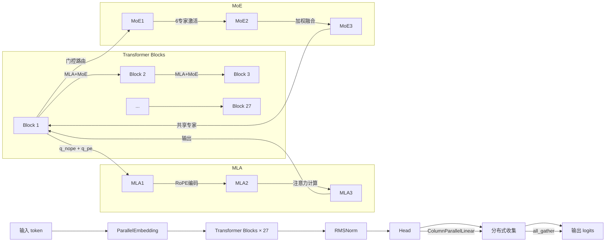
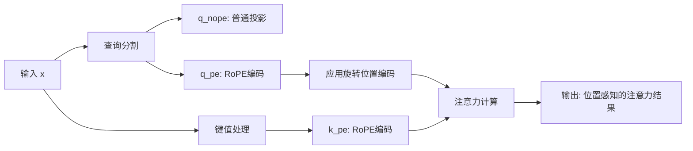

# ParallelEmbedding

## 核心功能
`ParallelEmbedding` 是一个**分布式并行词嵌入层**，将词汇表分割到多个GPU/进程上进行并行处理。

## 源代码分析

```python
class ParallelEmbedding(nn.Module):
    def __init__(self, vocab_size: int, dim: int):
        super().__init__()
        self.vocab_size = vocab_size
        self.dim = dim
        # 关键：词汇表必须能被世界大小整除
        assert vocab_size % world_size == 0, f"Vocabulary size must be divisible by world size (world_size={world_size})"
        
        # 计算每个进程负责的词汇表部分
        self.part_vocab_size = (vocab_size // world_size)
        self.vocab_start_idx = rank * self.part_vocab_size
        self.vocab_end_idx = self.vocab_start_idx + self.part_vocab_size
        
        # 每个进程只存储部分词向量
        self.weight = nn.Parameter(torch.empty(self.part_vocab_size, self.dim))

    def forward(self, x: torch.Tensor) -> torch.Tensor:
        if world_size > 1:
            # 1. 创建掩码：标记哪些token不在当前进程的负责范围内
            mask = (x < self.vocab_start_idx) | (x >= self.vocab_end_idx)
            # 2. 将token索引转换为局部索引
            x = x - self.vocab_start_idx
            # 3. 将超出范围的索引设为0（安全处理）
            x[mask] = 0
        
        # 4. 使用局部词向量进行嵌入查找
        y = F.embedding(x, self.weight)
        
        if world_size > 1:
            # 5. 将其他进程负责的token嵌入置零
            y[mask] = 0
            # 6. 所有进程求和，得到完整的嵌入结果
            dist.all_reduce(y)
        return y
```

---

# Linear

## 核心功能
`Linear` 是一个**支持量化的自定义线性层**，提供灵活的精度支持和分布式并行能力。

## 源代码分析

### 1. **基础 Linear 类**

```python
class Linear(nn.Module):
    dtype = torch.bfloat16  # 类变量，默认数据类型

    def __init__(self, in_features: int, out_features: int, bias: bool = False, dtype = None):
        super().__init__()
        self.in_features = in_features
        self.out_features = out_features
        
        # 核心：权重参数，支持量化
        self.weight = nn.Parameter(torch.empty(out_features, in_features, dtype=dtype or Linear.dtype))
        
        # 量化相关：如果权重是8-bit，需要额外的scale参数
        if self.weight.element_size() == 1:  # 检查是否是8-bit类型
            # 计算scale参数的形状（分块量化）
            scale_out_features = (out_features + block_size - 1) // block_size
            scale_in_features = (in_features + block_size - 1) // block_size
            self.weight.scale = self.scale = nn.Parameter(
                torch.empty(scale_out_features, scale_in_features, dtype=torch.float32)
            )
        else:
            self.register_parameter("scale", None)  # 非量化权重不需要scale
        
        # 偏置项（可选）
        if bias:
            self.bias = nn.Parameter(torch.empty(out_features))
        else:
            self.register_parameter("bias", None)
```

### 2. **核心计算函数 `linear`**

```python
def linear(x: torch.Tensor, weight: torch.Tensor, bias: Optional[torch.Tensor] = None) -> torch.Tensor:
    """
    支持量化的线性变换: y = xA^T + b
    """
    # 情况1: 权重已经是高精度（BF16/F32）
    if weight.element_size() > 1:
        return F.linear(x, weight, bias)
    
    # 情况2: 使用BF16 GEMM实现（反量化后计算）
    elif gemm_impl == "bf16":
        weight = weight_dequant(weight, weight.scale)  # 反量化权重
        return F.linear(x, weight, bias)
    
    # 情况3: FP8 GEMM（保持量化计算）
    else:
        x, scale = act_quant(x, block_size)  # 量化激活值
        y = fp8_gemm(x, scale, weight, weight.scale)  # FP8矩阵乘法
        
        if bias is not None:
            y += bias  # 添加偏置
            
        return y
```

### 3. **分布式并行变体**

#### **ColumnParallelLinear**
```python
class ColumnParallelLinear(Linear):
    def __init__(self, in_features: int, out_features: int, bias: bool = False, dtype = None):
        # 输出特征必须能被进程数整除
        assert out_features % world_size == 0, f"Output features must be divisible by world size (world_size={world_size})"
        
        # 每个进程负责的输出特征数
        self.part_out_features = out_features // world_size
        
        # 调用父类初始化，但使用部分输出特征
        super().__init__(in_features, self.part_out_features, bias, dtype)

    def forward(self, x: torch.Tensor) -> torch.Tensor:
        # 每个进程计算自己负责的部分输出
        y = linear(x, self.weight, self.bias)
        return y  # 输出形状: [*, part_out_features]
```

#### **RowParallelLinear**
```python
class RowParallelLinear(Linear):
    def __init__(self, in_features: int, out_features: int, bias: bool = False, dtype = None):
        # 输入特征必须能被进程数整除
        assert in_features % world_size == 0, f"Input features must be divisible by world size (world_size={world_size})"
        
        # 每个进程负责的输入特征数
        self.part_in_features = in_features // world_size
        
        # 调用父类初始化，但使用部分输入特征
        super().__init__(self.part_in_features, out_features, bias, dtype)

    def forward(self, x: torch.Tensor) -> torch.Tensor:
        # 每个进程使用部分输入进行计算
        y = linear(x, self.weight)
        
        # 跨进程求和（All-Reduce）
        if world_size > 1:
            dist.all_reduce(y)
        
        # 添加偏置（只在最终聚合后添加一次）
        if self.bias is not None:
            y += self.bias
            
        return y  # 输出形状: [*, out_features]
```

## 在DeepSeek-V3中的应用

### **注意力层中的使用**
```python
class MLA(nn.Module):
    def __init__(self, args: ModelArgs):
        # Query投影
        if self.q_lora_rank == 0:
            self.wq = ColumnParallelLinear(self.dim, self.n_heads * self.qk_head_dim)
        else:
            self.wq_a = Linear(self.dim, self.q_lora_rank)  # LoRA降维
            self.wq_b = ColumnParallelLinear(self.q_lora_rank, self.n_heads * self.qk_head_dim)
        
        # Key-Value投影  
        self.wkv_a = Linear(self.dim, self.kv_lora_rank + self.qk_rope_head_dim)
        self.wkv_b = ColumnParallelLinear(self.kv_lora_rank, self.n_heads * (self.qk_nope_head_dim + self.v_head_dim))
        
        # 输出投影
        self.wo = RowParallelLinear(self.n_heads * self.v_head_dim, self.dim)
```

### **MLP/MoE中的使用**
```python
class MLP(nn.Module):
    def __init__(self, dim: int, inter_dim: int):
        self.w1 = ColumnParallelLinear(dim, inter_dim)  # 升维
        self.w2 = RowParallelLinear(inter_dim, dim)     # 降维
        self.w3 = ColumnParallelLinear(dim, inter_dim)  # 门控
```

---

# 位置编码模块

## 核心功能
DeepSeek-V3使用了**改进的旋转位置编码(RoPE)**，结合**YaRN(Yet another RoPE extensioN)**方法来实现长度外推，支持从4K扩展到16K序列长度。

## 源代码分析

### 1. **主函数 `precompute_freqs_cis`**

```python
def precompute_freqs_cis(args: ModelArgs) -> torch.Tensor:
    """
    预计算用于旋转位置编码的基于频率的复数指数值
    """
    dim = args.qk_rope_head_dim        # 旋转位置编码的维度 (64)
    seqlen = args.max_seq_len          # 最大序列长度 (4096 * 4 = 16384)
    beta_fast = args.beta_fast         # 快速beta校正因子 (32)
    beta_slow = args.beta_slow         # 慢速beta校正因子 (1)
    base = args.rope_theta             # RoPE基数 (10000.0)
    factor = args.rope_factor          # 长度扩展因子 (40)

    def find_correction_dim(num_rotations, dim, base, max_seq_len):
        """
        计算给定旋转次数的校正维度
        """
        return dim * math.log(max_seq_len / (num_rotations * 2 * math.pi)) / (2 * math.log(base))

    def find_correction_range(low_rot, high_rot, dim, base, max_seq_len):
        """
        计算旋转位置编码的校正维度范围
        """
        low = math.floor(find_correction_dim(low_rot, dim, base, max_seq_len))
        high = math.ceil(find_correction_dim(high_rot, dim, base, max_seq_len))
        return max(low, 0), min(high, dim-1)

    def linear_ramp_factor(min, max, dim):
        """
        计算线性斜坡函数，用于在最小和最大范围之间平滑值
        """
        if min == max:
            max += 0.001
        linear_func = (torch.arange(dim, dtype=torch.float32) - min) / (max - min)
        ramp_func = torch.clamp(linear_func, 0, 1)
        return ramp_func

    # 1. 计算基础频率
    freqs = 1.0 / (base ** (torch.arange(0, dim, 2, dtype=torch.float32) / dim))
    
    # 2. 如果序列长度超过原始长度，应用YaRN扩展
    if seqlen > args.original_seq_len:
        # 找到需要校正的维度范围
        low, high = find_correction_range(beta_fast, beta_slow, dim, base, args.original_seq_len)
        # 计算平滑因子 (1 - 斜坡函数)
        smooth = 1 - linear_ramp_factor(low, high, dim // 2)
        # 调整频率：部分使用扩展因子缩小，部分保持原样
        freqs = freqs / factor * (1 - smooth) + freqs * smooth

    # 3. 为所有位置计算频率
    t = torch.arange(seqlen)
    freqs = torch.outer(t, freqs)  # 外积: [seqlen, dim//2]
    
    # 4. 转换为复数形式 (欧拉公式: e^(iθ) = cosθ + i*sinθ)
    freqs_cis = torch.polar(torch.ones_like(freqs), freqs)
    return freqs_cis
```

### 2. **应用函数 `apply_rotary_emb`**

```python
def apply_rotary_emb(x: torch.Tensor, freqs_cis: torch.Tensor) -> torch.Tensor:
    """
    将旋转位置编码应用到输入张量
    """
    # 1. 保存原始数据类型
    dtype = x.dtype
    
    # 2. 将输入转换为复数形式
    # 将最后维度分成实部和虚部: [..., dim] -> [..., dim//2, 2] -> 复数
    x = torch.view_as_complex(x.float().view(*x.shape[:-1], -1, 2))
    
    # 3. 调整频率张量形状以便广播
    freqs_cis = freqs_cis.view(1, x.size(1), 1, x.size(-1))
    
    # 4. 应用旋转: 复数乘法 = 旋转
    y = torch.view_as_real(x * freqs_cis).flatten(3)
    
    # 5. 恢复原始数据类型
    return y.to(dtype)
```

## 旋转位置编码原理

### **数学基础**
旋转位置编码的核心思想是通过复数乘法来实现旋转：

```
对于位置m的查询向量q和位置n的键向量k：
q_m · k_n = Re[ (q_m * e^(imθ)) · conj(k_n * e^(inθ)) ]
          = Re[ q_m · conj(k_n) * e^(i(m-n)θ) ]
```

### **复数表示**
```python
# 输入x: [batch, seq, heads, dim] 其中dim是qk_rope_head_dim
# 转换为复数: 将最后维度分成实部和虚部
x_complex = x.view(*shape[:-1], -1, 2)  # [..., dim//2, 2]
x_complex = torch.view_as_complex(x_complex)  # [..., dim//2] (复数)

# 频率复数: e^(iθ) = cosθ + i*sinθ
freqs_cis = torch.polar(torch.ones_like(freqs), freqs)  # 模长为1，角度为freqs
```

## YaRN长度外推技术

### **问题背景**
传统RoPE在训练长度外表现不佳，YaRN通过动态调整频率来解决这个问题。

### **YaRN实现细节**

```python
# 当序列长度超过原始训练长度时
if seqlen > args.original_seq_len:
    # 1. 计算需要调整的维度范围
    low, high = find_correction_range(beta_fast, beta_slow, dim, base, args.original_seq_len)
    # low: 需要完全调整的维度起始索引
    # high: 需要完全调整的维度结束索引
    
    # 2. 创建平滑过渡的掩码
    smooth = 1 - linear_ramp_factor(low, high, dim // 2)
    # smooth: 在[low, high]范围内从0线性增加到1
    
    # 3. 混合调整后的频率和原始频率
    freqs = freqs / factor * (1 - smooth) + freqs * smooth
    # - 低维度: 使用调整后的频率 (freqs / factor)
    # - 高维度: 使用原始频率 (freqs)
    # - 中间维度: 线性混合
```

### **校正维度计算**
```python
def find_correction_dim(num_rotations, dim, base, max_seq_len):
    """
    计算在max_seq_len处恰好完成num_rotations次旋转的维度
    """
    return dim * math.log(max_seq_len / (num_rotations * 2 * math.pi)) / (2 * math.log(base))

# 示例: 对于dim=64, base=10000, max_seq_len=4096
# beta_fast=32: 在4096长度内完成32次旋转的维度
# beta_slow=1:  在4096长度内完成1次旋转的维度
```

## 在MLA中的应用

### **查询和键的旋转编码**
```python
class MLA(nn.Module):
    def forward(self, x: torch.Tensor, start_pos: int, freqs_cis: torch.Tensor, mask: Optional[torch.Tensor]):
        # 1. 获取查询向量并分割
        q = q.view(bsz, seqlen, self.n_local_heads, self.qk_head_dim)
        q_nope, q_pe = torch.split(q, [self.qk_nope_head_dim, self.qk_rope_head_dim], dim=-1)
        
        # 2. 对位置编码部分应用旋转
        q_pe = apply_rotary_emb(q_pe, freqs_cis)
        
        # 3. 获取键的位置编码部分
        kv, k_pe = torch.split(kv, [self.kv_lora_rank, self.qk_rope_head_dim], dim=-1)
        k_pe = apply_rotary_emb(k_pe.unsqueeze(2), freqs_cis)
        
        # 4. 重新组合
        q = torch.cat([q_nope, q_pe], dim=-1)  # 旋转后的查询
        k = torch.cat([k_nope, k_pe.expand(-1, -1, self.n_local_heads, -1)], dim=-1)  # 旋转后的键
```

### **注意力分数计算**
```python
# 注意力分数包含相对位置信息
scores = torch.einsum("bshd,bthd->bsht", q, k) * self.softmax_scale
# 由于旋转编码，q和k的点积自动包含相对位置信息
```

## 动态缩放机制

### **注意力缩放调整**
```python
class MLA(nn.Module):
    def __init__(self, args: ModelArgs):
        self.softmax_scale = self.qk_head_dim ** -0.5  # 基础缩放
        
        # 当序列长度扩展时，调整softmax缩放因子
        if args.max_seq_len > args.original_seq_len:
            mscale = 0.1 * args.mscale * math.log(args.rope_factor) + 1.0
            self.softmax_scale = self.softmax_scale * mscale * mscale
```

---

# MLA (Multi-Head Latent Attention)

## 核心功能
MLA 是 DeepSeek-V3 的核心注意力机制，结合了**低秩适应(LoRA)**、**旋转位置编码**和**两种不同的实现策略**，在保持强大表达能力的同时大幅优化内存和计算效率。

## 源代码结构分析

### 1. **MLA 类定义**

```python
class MLA(nn.Module):
    def __init__(self, args: ModelArgs):
        super().__init__()
        self.dim = args.dim
        self.n_heads = args.n_heads
        self.n_local_heads = args.n_heads // world_size  # 分布式头数
        
        # LoRA 配置
        self.q_lora_rank = args.q_lora_rank
        self.kv_lora_rank = args.kv_lora_rank
        
        # 头维度配置
        self.qk_nope_head_dim = args.qk_nope_head_dim  # 非位置编码头维度 (128)
        self.qk_rope_head_dim = args.qk_rope_head_dim  # 旋转位置编码头维度 (64)  
        self.qk_head_dim = args.qk_nope_head_dim + args.qk_rope_head_dim  # 总头维度 (192)
        self.v_head_dim = args.v_head_dim  # 值头维度 (128)
        
        # Query 投影 (可选LoRA)
        if self.q_lora_rank == 0:
            self.wq = ColumnParallelLinear(self.dim, self.n_heads * self.qk_head_dim)
        else:
            self.wq_a = Linear(self.dim, self.q_lora_rank)      # LoRA降维
            self.q_norm = RMSNorm(self.q_lora_rank)             # 归一化
            self.wq_b = ColumnParallelLinear(self.q_lora_rank, self.n_heads * self.qk_head_dim)
        
        # Key-Value 投影 (LoRA + 位置编码)
        self.wkv_a = Linear(self.dim, self.kv_lora_rank + self.qk_rope_head_dim)
        self.kv_norm = RMSNorm(self.kv_lora_rank)
        self.wkv_b = ColumnParallelLinear(self.kv_lora_rank, self.n_heads * (self.qk_nope_head_dim + self.v_head_dim))
        
        # 输出投影
        self.wo = RowParallelLinear(self.n_heads * self.v_head_dim, self.dim)
        
        # 注意力缩放因子
        self.softmax_scale = self.qk_head_dim ** -0.5
        if args.max_seq_len > args.original_seq_len:
            mscale = 0.1 * args.mscale * math.log(args.rope_factor) + 1.0
            self.softmax_scale = self.softmax_scale * mscale * mscale  # YaRN缩放调整

        # 缓存初始化 (两种实现策略)
        if attn_impl == "naive":
            self.register_buffer("k_cache", torch.zeros(args.max_batch_size, args.max_seq_len, self.n_local_heads, self.qk_head_dim), persistent=False)
            self.register_buffer("v_cache", torch.zeros(args.max_batch_size, args.max_seq_len, self.n_local_heads, self.v_head_dim), persistent=False)
        else:
            self.register_buffer("kv_cache", torch.zeros(args.max_batch_size, args.max_seq_len, self.kv_lora_rank), persistent=False)
            self.register_buffer("pe_cache", torch.zeros(args.max_batch_size, args.max_seq_len, self.qk_rope_head_dim), persistent=False)
```

## 两种实现策略详解

### 策略1: **Naive 实现** (传统KV缓存)

```python
def forward_naive(self, x: torch.Tensor, start_pos: int, freqs_cis: torch.Tensor, mask: Optional[torch.Tensor]):
    bsz, seqlen, _ = x.size()
    end_pos = start_pos + seqlen
    
    # 1. Query 投影
    if self.q_lora_rank == 0:
        q = self.wq(x)
    else:
        q = self.wq_b(self.q_norm(self.wq_a(x)))  # LoRA路径
    q = q.view(bsz, seqlen, self.n_local_heads, self.qk_head_dim)
    
    # 2. 分割并应用旋转位置编码
    q_nope, q_pe = torch.split(q, [self.qk_nope_head_dim, self.qk_rope_head_dim], dim=-1)
    q_pe = apply_rotary_emb(q_pe, freqs_cis)  # 应用旋转位置编码
    
    # 3. Key-Value 投影
    kv = self.wkv_a(x)
    kv, k_pe = torch.split(kv, [self.kv_lora_rank, self.qk_rope_head_dim], dim=-1)
    k_pe = apply_rotary_emb(k_pe.unsqueeze(2), freqs_cis)  # 键的位置编码
    
    # 4. 完整的Key-Value计算
    kv = self.wkv_b(self.kv_norm(kv))
    kv = kv.view(bsz, seqlen, self.n_local_heads, self.qk_nope_head_dim + self.v_head_dim)
    k_nope, v = torch.split(kv, [self.qk_nope_head_dim, self.v_head_dim], dim=-1)
    
    # 5. 组合完整的Key
    k = torch.cat([k_nope, k_pe.expand(-1, -1, self.n_local_heads, -1)], dim=-1)
    
    # 6. 更新缓存
    self.k_cache[:bsz, start_pos:end_pos] = k
    self.v_cache[:bsz, start_pos:end_pos] = v
    
    # 7. 注意力计算
    q = torch.cat([q_nope, q_pe], dim=-1)  # 完整的Query
    scores = torch.einsum("bshd,bthd->bsht", q, self.k_cache[:bsz, :end_pos]) * self.softmax_scale
    
    if mask is not None:
        scores += mask.unsqueeze(1)
    
    scores = scores.softmax(dim=-1, dtype=torch.float32).type_as(x)
    
    # 8. 输出计算
    x = torch.einsum("bsht,bthd->bshd", scores, self.v_cache[:bsz, :end_pos])
    x = self.wo(x.flatten(2))
    
    return x
```

### 策略2: **Absorb 实现** (吸收式注意力)

```python
def forward_absorb(self, x: torch.Tensor, start_pos: int, freqs_cis: torch.Tensor, mask: Optional[torch.Tensor]):
    bsz, seqlen, _ = x.size()
    end_pos = start_pos + seqlen
    
    # 1. Query 投影 (与naive相同)
    if self.q_lora_rank == 0:
        q = self.wq(x)
    else:
        q = self.wq_b(self.q_norm(self.wq_a(x)))
    q = q.view(bsz, seqlen, self.n_local_heads, self.qk_head_dim)
    q_nope, q_pe = torch.split(q, [self.qk_nope_head_dim, self.qk_rope_head_dim], dim=-1)
    q_pe = apply_rotary_emb(q_pe, freqs_cis)
    
    # 2. Key-Value 投影 (与naive相同)
    kv = self.wkv_a(x)
    kv, k_pe = torch.split(kv, [self.kv_lora_rank, self.qk_rope_head_dim], dim=-1)
    k_pe = apply_rotary_emb(k_pe.unsqueeze(2), freqs_cis)
    
    # 3. 吸收式核心: 延迟投影
    # 获取反量化的权重 (如果需要)
    wkv_b = self.wkv_b.weight if self.wkv_b.scale is None else weight_dequant(self.wkv_b.weight, self.wkv_b.scale, block_size) 
    wkv_b = wkv_b.view(self.n_local_heads, -1, self.kv_lora_rank)  # [heads, (qk_nope+value), kv_rank]
    
    # 4. Query与权重的提前计算
    q_nope = torch.einsum("bshd,hdc->bshc", q_nope, wkv_b[:, :self.qk_nope_head_dim])
    
    # 5. 更新轻量级缓存
    self.kv_cache[:bsz, start_pos:end_pos] = self.kv_norm(kv)  # 只缓存低秩表示
    self.pe_cache[:bsz, start_pos:end_pos] = k_pe.squeeze(2)   # 位置编码缓存
    
    # 6. 注意力分数计算 (分解形式)
    scores = (torch.einsum("bshc,btc->bsht", q_nope, self.kv_cache[:bsz, :end_pos]) +  # 非位置部分
              torch.einsum("bshr,btr->bsht", q_pe, self.pe_cache[:bsz, :end_pos])) * self.softmax_scale  # 位置部分
    
    if mask is not None:
        scores += mask.unsqueeze(1)
    
    scores = scores.softmax(dim=-1, dtype=torch.float32).type_as(x)
    
    # 7. 输出计算 (延迟投影)
    x = torch.einsum("bsht,btc->bshc", scores, self.kv_cache[:bsz, :end_pos])  # 注意力加权
    x = torch.einsum("bshc,hdc->bshd", x, wkv_b[:, -self.v_head_dim:])         # 值投影
    x = self.wo(x.flatten(2))
    
    return x
```

## LoRA 机制详解

### **Query LoRA 路径**
```python
if self.q_lora_rank == 0:
    # 标准投影: dim → (heads × head_dim)
    q = self.wq(x)  
else:
    # LoRA路径: dim → q_lora_rank → (heads × head_dim)
    q = self.wq_a(x)        # [batch, seq, dim] → [batch, seq, q_lora_rank]
    q = self.q_norm(q)      # RMS归一化
    q = self.wq_b(q)        # [batch, seq, q_lora_rank] → [batch, seq, heads×head_dim]
```

### **Key-Value LoRA 路径**
```python
# 第一步: 同时获取低秩表示和位置编码
kv = self.wkv_a(x)  # [batch, seq, dim] → [batch, seq, kv_lora_rank + qk_rope_head_dim]
kv, k_pe = torch.split(kv, [self.kv_lora_rank, self.qk_rope_head_dim], dim=-1)

# 第二步: 低秩表示的归一化和投影
kv = self.kv_norm(kv)
kv = self.wkv_b(kv)  # [batch, seq, kv_lora_rank] → [batch, seq, heads×(qk_nope_head_dim + v_head_dim)]
```

---

# MoE (Mixture of Experts)

## 核心功能
MoE模块是DeepSeek-V3实现**稀疏激活**的关键组件，通过**专家混合**机制在保持计算效率的同时大幅增加模型参数量，实现"大模型容量，小模型计算"的效果。

## 源代码结构分析

### 1. **Gate (门控机制)**

```python
class Gate(nn.Module):
    def __init__(self, args: ModelArgs):
        super().__init__()
        self.dim = args.dim
        self.topk = args.n_activated_experts      # 每个token激活的专家数 (6)
        self.n_groups = args.n_expert_groups      # 专家分组数 (1)
        self.topk_groups = args.n_limited_groups  # 限制的组数 (1)
        self.score_func = args.score_func         # 得分函数: "softmax" 或 "sigmoid"
        self.route_scale = args.route_scale       # 路由缩放因子 (1.0)
        
        # 门控权重: [n_routed_experts, dim]
        self.weight = nn.Parameter(torch.empty(args.n_routed_experts, args.dim))
        
        # 偏置项: 仅在特定维度下使用
        self.bias = nn.Parameter(torch.empty(args.n_routed_experts)) if self.dim == 7168 else None

    def forward(self, x: torch.Tensor) -> Tuple[torch.Tensor, torch.Tensor]:
        """
        门控前向传播: 计算每个token应该路由到哪些专家
        """
        # 1. 计算专家得分
        scores = linear(x, self.weight)  # [batch_size * seq_len, n_routed_experts]
        
        # 2. 应用得分函数
        if self.score_func == "softmax":
            scores = scores.softmax(dim=-1, dtype=torch.float32)
        else:
            scores = scores.sigmoid()
        
        original_scores = scores  # 保存原始得分用于后续计算
        
        # 3. 添加偏置 (如果存在)
        if self.bias is not None:
            scores = scores + self.bias
        
        # 4. 专家分组处理
        if self.n_groups > 1:
            # 将得分重塑为分组形式
            scores = scores.view(x.size(0), self.n_groups, -1)
            
            # 计算组得分
            if self.bias is None:
                group_scores = scores.amax(dim=-1)  # 每组最大得分
            else:
                group_scores = scores.topk(2, dim=-1)[0].sum(dim=-1)  # 每组top2得分和
            
            # 选择topk_groups个组
            indices = group_scores.topk(self.topk_groups, dim=-1)[1]
            
            # 创建掩码: 将未选中的组标记为True
            mask = scores.new_ones(x.size(0), self.n_groups, dtype=bool).scatter_(1, indices, False)
            
            # 将未选中组的得分设为负无穷
            scores = scores.masked_fill_(mask.unsqueeze(-1), float("-inf")).flatten(1)
        
        # 5. 选择topk专家
        indices = torch.topk(scores, self.topk, dim=-1)[1]  # [batch_size * seq_len, topk]
        
        # 6. 计算路由权重
        weights = original_scores.gather(1, indices)  # 从原始得分中收集对应位置的权重
        
        # 7. 对于sigmoid函数，需要归一化权重
        if self.score_func == "sigmoid":
            weights /= weights.sum(dim=-1, keepdim=True)
        
        # 8. 应用路由缩放
        weights *= self.route_scale
        
        return weights.type_as(x), indices
```

### 2. **Expert (专家网络)**

```python
class Expert(nn.Module):
    def __init__(self, dim: int, inter_dim: int):
        super().__init__()
        # 专家网络结构与MLP相同，但维度不同
        self.w1 = Linear(dim, inter_dim)  # 升维: 2048 → 1408
        self.w2 = Linear(inter_dim, dim)  # 降维: 1408 → 2048
        self.w3 = Linear(dim, inter_dim)  # 门控: 2048 → 1408

    def forward(self, x: torch.Tensor) -> torch.Tensor:
        """
        专家前向传播: 使用Swish门控的MLP
        """
        return self.w2(F.silu(self.w1(x)) * self.w3(x))
```

### 3. **MoE (混合专家层)**

```python
class MoE(nn.Module):
    def __init__(self, args: ModelArgs):
        super().__init__()
        self.dim = args.dim
        # 确保专家数量能被进程数整除
        assert args.n_routed_experts % world_size == 0, f"Number of experts must be divisible by world size (world_size={world_size})"
        
        self.n_routed_experts = args.n_routed_experts      # 总专家数 (64)
        self.n_local_experts = args.n_routed_experts // world_size  # 每个进程的专家数
        self.n_activated_experts = args.n_activated_experts  # 激活专家数 (6)
        
        # 计算当前进程负责的专家范围
        self.experts_start_idx = rank * self.n_local_experts
        self.experts_end_idx = self.experts_start_idx + self.n_local_experts
        
        # 门控机制
        self.gate = Gate(args)
        
        # 专家列表: 每个进程只实例化自己负责的专家
        self.experts = nn.ModuleList([
            Expert(args.dim, args.moe_inter_dim) if self.experts_start_idx <= i < self.experts_end_idx else None
            for i in range(self.n_routed_experts)
        ])
        
        # 共享专家: 所有token都会经过的共享MLP
        self.shared_experts = MLP(args.dim, args.n_shared_experts * args.moe_inter_dim)

    def forward(self, x: torch.Tensor) -> torch.Tensor:
        """
        MoE前向传播: 将输入路由到不同的专家，然后聚合结果
        """
        # 1. 保存原始形状并展平输入
        shape = x.size()  # [batch_size, seq_len, dim]
        x = x.view(-1, self.dim)  # [batch_size * seq_len, dim]
        
        # 2. 通过门控获取路由权重和专家索引
        weights, indices = self.gate(x)  # weights: [n_tokens, topk], indices: [n_tokens, topk]
        
        # 3. 初始化输出张量
        y = torch.zeros_like(x)  # [n_tokens, dim]
        
        # 4. 统计每个专家被选择的次数
        counts = torch.bincount(indices.flatten(), minlength=self.n_routed_experts).tolist()
        
        # 5. 处理当前进程负责的专家
        for i in range(self.experts_start_idx, self.experts_end_idx):
            if counts[i] == 0:  # 如果当前专家没有被任何token选择
                continue
                
            expert = self.experts[i]  # 获取专家网络
            
            # 找到选择当前专家的所有token及其在topk中的位置
            idx, top = torch.where(indices == i)
            # idx: token索引, top: 在topk中的位置(0~topk-1)
            
            # 计算专家输出并加权累加
            y[idx] += expert(x[idx]) * weights[idx, top, None]
            # weights[idx, top, None]: [selected_tokens, 1] 用于广播
        
        # 6. 计算共享专家输出 (所有token都会经过)
        z = self.shared_experts(x)
        
        # 7. 跨进程聚合专家输出
        if world_size > 1:
            dist.all_reduce(y)
        
        # 8. 组合专家输出和共享专家输出，恢复形状
        return (y + z).view(shape)
```

## MoE工作流程详解

### **整体流程**
```
输入: [batch_size, seq_len, dim]
     ↓ 展平
输入: [batch_size * seq_len, dim]
     ↓ 门控路由
每个token选择topk个专家 + 路由权重
     ↓ 专家计算
每个专家处理分配给它的token
     ↓ 加权聚合
汇总所有专家输出 + 共享专家输出
     ↓ 恢复形状
输出: [batch_size, seq_len, dim]
```

### **路由机制示例**
```python
# 假设有3个token，每个选择2个专家
indices = [[2, 15],   # token0选择专家2和15
           [7, 45],   # token1选择专家7和45  
           [15, 60]]  # token2选择专家15和60

weights = [[0.6, 0.4],  # token0的路由权重
           [0.7, 0.3],  # token1的路由权重
           [0.5, 0.5]]  # token2的路由权重

# 计算过程:
# token0: y[0] = expert2(x[0]) * 0.6 + expert15(x[0]) * 0.4
# token1: y[1] = expert7(x[1]) * 0.7 + expert45(x[1]) * 0.3  
# token2: y[2] = expert15(x[2]) * 0.5 + expert60(x[2]) * 0.5
```

## 门控机制详解

### **Softmax vs Sigmoid 路由**

#### **Softmax路由**
```python
scores = linear(x, self.weight)  # [n_tokens, n_experts]
scores = scores.softmax(dim=-1)  # 归一化为概率分布
# 特点: 权重和为1，具有竞争性
```

#### **Sigmoid路由**
```python  
scores = linear(x, self.weight)
scores = scores.sigmoid()  # 每个专家独立评分
weights /= weights.sum(dim=-1, keepdim=True)  # 后归一化
# 特点: 允许多个专家高权重，更灵活
```

### **专家分组机制**
```python
if self.n_groups > 1:
    # 将专家分成多个组
    scores = scores.view(x.size(0), self.n_groups, -1)  # [batch, n_groups, experts_per_group]
    
    # 计算组重要性得分
    group_scores = scores.amax(dim=-1)  # 每组最大专家得分
    
    # 选择最重要的topk_groups个组
    group_indices = group_scores.topk(self.topk_groups, dim=-1)[1]
    
    # 掩码掉不重要的组
    mask = ...  # 创建掩码
    scores = scores.masked_fill_(mask, float("-inf"))
```

## 在DeepSeek-V3中的应用

### **Transformer块中的集成**
```python
class Block(nn.Module):
    def __init__(self, layer_id: int, args: ModelArgs):
        super().__init__()
        self.attn = MLA(args)
        # 前n_dense_layers使用稠密MLP，后续层使用MoE
        self.ffn = MLP(args.dim, args.inter_dim) if layer_id < args.n_dense_layers else MoE(args)
        self.attn_norm = RMSNorm(args.dim)
        self.ffn_norm = RMSNorm(args.dim)

    def forward(self, x: torch.Tensor, start_pos: int, freqs_cis: torch.Tensor, mask: Optional[torch.Tensor]) -> torch.Tensor:
        x = x + self.attn(self.attn_norm(x), start_pos, freqs_cis, mask)
        x = x + self.ffn(self.ffn_norm(x))  # 这里可能是MoE
        return x
```

### **配置参数**
```python
# ModelArgs中的MoE相关配置
n_routed_experts: int = 64        # 总专家数
n_shared_experts: int = 2         # 共享专家数  
n_activated_experts: int = 6      # 每个token激活的专家数
n_expert_groups: int = 1          # 专家分组数
n_limited_groups: int = 1         # 限制的组数
score_func: Literal["softmax", "sigmoid"] = "softmax"  # 路由函数
route_scale: float = 1.           # 路由缩放
moe_inter_dim: int = 1408         # 专家中间维度
```

## 性能特点

### **稀疏激活优势**
```
标准稠密模型: 所有参数对每个输入都激活
MoE模型: 只有部分专家对每个输入激活

效果:
- 参数量: 大幅增加 (64倍于稠密层)
- 计算量: 小幅增加 (6/64 ≈ 9.4% 的专家被激活)
- 内存占用: 主要增加参数存储，激活内存增加有限
```

### **通信模式**
```python
# 前向传播通信模式
1. 每个进程计算自己负责专家的输出
2. 使用 all_reduce 聚合所有专家的输出
3. 通信量: [batch_size * seq_len, dim] 的梯度

# 相比模型并行的优势: 通信发生在专家计算之后，而不是之间
```

---

# Transformer

## 整体架构概览

`Transformer` 类是 DeepSeek-V3 的**核心集成模块**，将前面介绍的所有组件（Embedding、MLA、MLP/MoE、RMSNorm、位置编码等）整合成一个完整的语言模型。

## 源代码详细分析

### 1. **Transformer 类定义**

```python
class Transformer(nn.Module):
    def __init__(self, args: ModelArgs):
        global world_size, rank
        # 1. 初始化分布式环境
        world_size = dist.get_world_size() if dist.is_initialized() else 1
        rank = dist.get_rank() if dist.is_initialized() else 0
        
        # 2. 设置全局数据类型 (FP8或BF16)
        Linear.dtype = torch.float8_e4m3fn if args.dtype == "fp8" else torch.bfloat16
        
        super().__init__()
        self.max_seq_len = args.max_seq_len
        
        # 3. 构建模型组件
        self.embed = ParallelEmbedding(args.vocab_size, args.dim)  # 并行嵌入层
        self.layers = torch.nn.ModuleList()  # Transformer层列表
        
        # 4. 创建所有Transformer块 (混合稠密和MoE层)
        for layer_id in range(args.n_layers):
            self.layers.append(Block(layer_id, args))
        
        self.norm = RMSNorm(args.dim)  # 最终归一化层
        # 输出投影层 (列并行，因为输出词汇表很大)
        self.head = ColumnParallelLinear(args.dim, args.vocab_size, dtype=torch.get_default_dtype())
        
        # 5. 预计算位置编码并注册为缓冲区
        self.register_buffer("freqs_cis", precompute_freqs_cis(args), persistent=False)

    @torch.inference_mode()
    def forward(self, tokens: torch.Tensor, start_pos: int = 0):
        """
        前向传播 (推理模式)
        
        Args:
            tokens: 输入token IDs [batch_size, seq_len]
            start_pos: 序列开始位置，用于生成任务
            
        Returns:
            logits: 下一个token的预测logits [batch_size, vocab_size]
        """
        seqlen = tokens.size(1)
        
        # 1. 词嵌入
        h = self.embed(tokens)  # [batch_size, seq_len, dim]
        
        # 2. 获取当前序列的位置编码
        freqs_cis = self.freqs_cis[start_pos:start_pos+seqlen]
        
        # 3. 构建因果注意力掩码 (仅训练或seqlen>1时需要)
        mask = None
        if seqlen > 1:
            mask = torch.full((seqlen, seqlen), float("-inf"), device=tokens.device).triu_(1)
        
        # 4. 逐层通过Transformer块
        for layer in self.layers:
            h = layer(h, start_pos, freqs_cis, mask)
        
        # 5. 最终归一化并取最后一个token的隐藏状态
        h = self.norm(h)[:, -1]  # [batch_size, dim]
        
        # 6. 输出投影到词汇表
        logits = self.head(h)  # [batch_size, part_vocab_size] (分布式)
        
        # 7. 分布式环境下聚合所有词汇表分片
        if world_size > 1:
            all_logits = [torch.empty_like(logits) for _ in range(world_size)]
            dist.all_gather(all_logits, logits)
            logits = torch.cat(all_logits, dim=-1)  # [batch_size, vocab_size]
        
        return logits
```

## 完整前向传播流程

### **数据流图解**
```
输入Tokens: [batch_size, seq_len]
     ↓
ParallelEmbedding
     ↓
隐藏状态: [batch_size, seq_len, dim]
     ↓
循环通过 n_layers 个 Block:
    ├─ Block 0 (稠密MLP)
    ├─ Block 1 (稠密MLP)
    ├─ ...
    ├─ Block n_dense_layers-1 (稠密MLP)  
    └─ Block n_dense_layers 到 n_layers-1 (MoE)
     ↓
RMSNorm 最终归一化
     ↓
取最后一个token: [batch_size, dim]
     ↓
ColumnParallelLinear 输出投影
     ↓
All-Gather 词汇表聚合 (分布式)
     ↓
输出Logits: [batch_size, vocab_size]
```

### **Block 层详细流程**
```python
class Block(nn.Module):
    def forward(self, x: torch.Tensor, start_pos: int, freqs_cis: torch.Tensor, mask: Optional[torch.Tensor]) -> torch.Tensor:
        # 残差连接 + 注意力
        x = x + self.attn(self.attn_norm(x), start_pos, freqs_cis, mask)
        # 残差连接 + 前馈网络 (MLP或MoE)
        x = x + self.ffn(self.ffn_norm(x))
        return x
```

---







```mermaid
%% 模块内部流程图
flowchart TD
    %% 1. Transformer Block (智能咖啡师)
    subgraph Transformer_Block
        A[输入 x] --> B[注意力层归一化]
        B --> C[MLA注意力计算]
        C --> D[残差连接]
        D --> E[前馈层归一化]
        E --> F[MoE/MLP专家网络]
        F --> G[残差连接]
        G --> H[输出 x]
    end

    %% 2. MLA (多头潜伏注意力)
    subgraph MLA
        I[输入 x, freqs_cis] --> J[分割查询: q_nope + q_pe]
        J --> K[q_pe → RoPE旋转位置编码]
        I --> L[键值处理: k_pe]
        K --> M[计算注意力得分]
        L --> M
        M --> N[输出: 聚焦关键信息]
    end

    %% 3. MoE (混合专家)
    subgraph MoE
        O[输入 x] --> P[门控路由: 评分6个专家]
        P --> Q[专家执行: 6个专家处理]
        Q --> R[加权融合: 专家结果权重]
        R --> S[共享专家: 2个通用专家优化]
        S --> T[分布式归一化]
        T --> U[输出]
    end

    %% 4. RMSNorm (层归一化)
    subgraph RMSNorm
        V[输入 x] --> W[计算RMS]
        W --> X[x / RMS]
        X --> Y[输出: 情绪稳定的向量]
    end
```

> 
