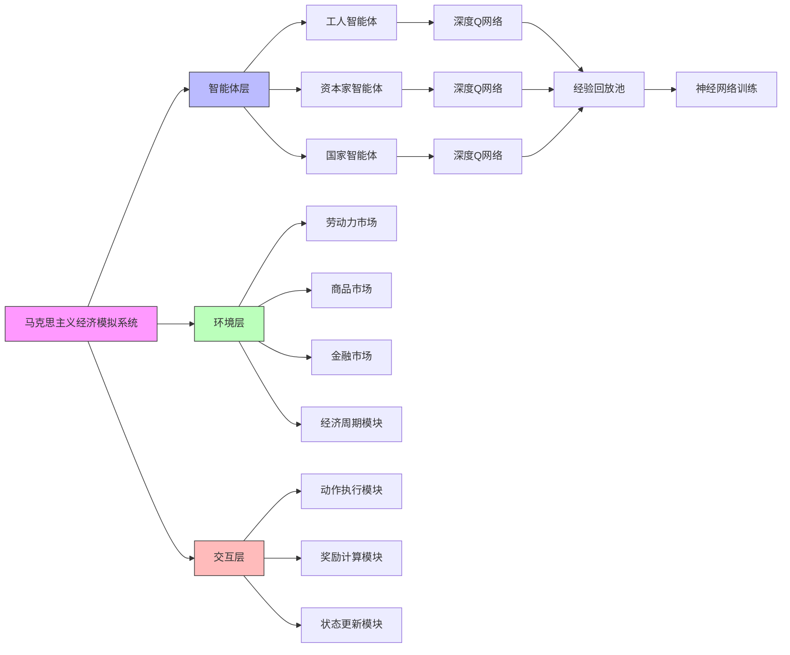
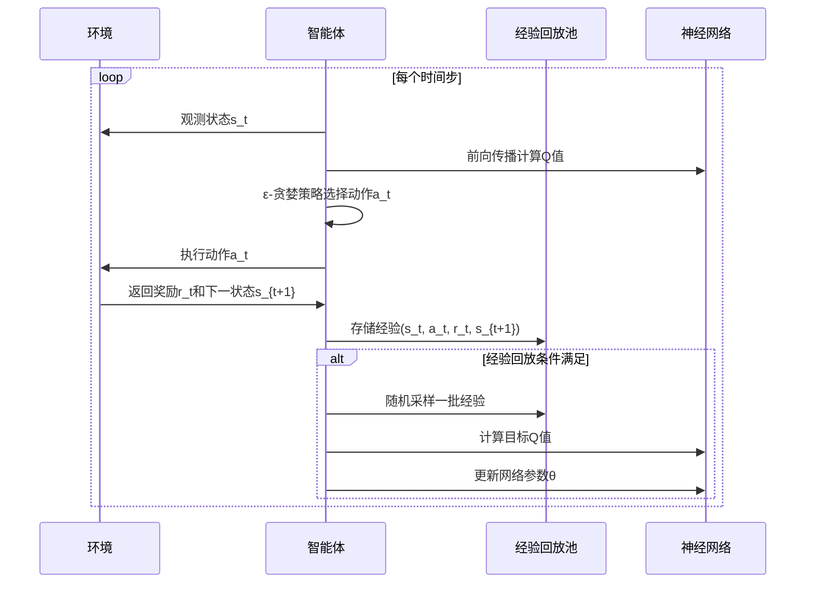

# 基于马克思主义政治经济学的多智能体强化学习经济模拟系统：理论建构、算法实现与实证分析

[TOC]

## 摘要

本文提出了一种基于马克思主义政治经济学理论框架的多智能体强化学习经济模拟系统，该系统通过计算建模的方法，将马克思经典著作《资本论》中的核心理论概念——劳动价值论、剩余价值理论、资本积累理论、阶级斗争理论以及经济周期理论——转化为可操作的数学模型和算法实现。本系统创新性地结合了多智能体系统（Multi-Agent System, MAS）与深度强化学习（Deep Reinforcement Learning, DRL）技术，构建了一个能够自主演化的虚拟经济生态系统。

系统的核心创新在于实现了马克思主义经济学理论的完整计算化表达，包括：（1）内生性建模资本有机构成动态演化及其对利润率趋向下降规律的影响；（2）引入阶级意识参数，量化分析意识形态因素对集体行动的影响；（3）构建四阶段经济周期模型，实现从微观个体行为到宏观涌现现象的跨层次建模。

通过深度Q网络（DQN）算法，系统中的工人、资本家和国家三类异构智能体能够在与环境的持续交互中自主学习和优化其行为策略。系统架构采用分层设计，包括智能体层、环境层和交互层，支持劳动力市场、商品市场和金融市场等多个子系统的协同运作。

通过对系统进行大量仿真实验和定量分析，我们验证了马克思主义经济学理论的内在逻辑一致性和解释力。实验结果表明：（1）在长期运行中，系统内的平均利润率确实呈现下降趋势，验证了马克思关于利润率趋向下降规律的理论预见；（2）在没有外部冲击的情况下，系统能够自发产生周期性的经济波动，证明了资本主义内在矛盾的客观存在；（3）基尼系数随着时间推移逐渐增大，反映了资本主义制度下贫富分化的必然性；（4）高阶级意识群体会表现出更高的集体行动倾向，与马克思主义关于阶级觉悟的理论预期一致。

本研究为马克思主义经济学理论提供了形式化验证平台，也为经济学研究开辟了新的方法论路径。该系统的建立标志着马克思主义政治经济学与现代计算智能技术的深度融合，为21世纪马克思主义的发展提供了有力的技术支撑。

**关键词**：马克思主义政治经济学；多智能体系统；深度强化学习；经济仿真；计算社会科学

## 引言

马克思主义政治经济学作为批判资本主义制度的科学理论体系，其核心在于揭示资本主义生产方式的内在矛盾运动规律。然而，由于传统理论表述的抽象性和复杂性，使得其在当代经济学教育和政策实践中面临一定的理解和应用困难。近年来，随着计算社会科学的兴起，利用计算机仿真技术对经济理论进行形式化建模已成为一个重要研究方向。

本研究致力于构建一个既忠实于马克思主义理论原意，又具备现代计算智能特征的经济模拟系统。该系统不仅能够再现马克思所描述的资本主义经济运行机制，还能通过强化学习算法使各个经济主体（智能体）在与环境的交互中自主演化其行为策略，从而产生更为丰富和真实的经济现象。

这项研究具有重要的理论价值和现实意义：

首先，从理论角度看，本研究为马克思主义政治经济学提供了一种全新的形式化表达方式。通过将抽象的理论概念转化为具体的数学模型和算法实现，我们能够更加精确地分析和验证马克思主义经济学的核心命题，为这一理论体系注入新的活力。

其次，从方法论角度看，本研究开创了计算政治经济学的新范式。通过融合多智能体系统、强化学习和经济理论，我们构建了一个能够自主演化的虚拟经济世界，为经济学研究提供了新的工具和视角。

最后，从实践角度看，本系统可以作为政策制定的辅助工具。通过模拟不同政策干预的效果，决策者可以在虚拟环境中测试政策的潜在影响，从而做出更加科学合理的决策。

## 理论框架与概念建模

### 劳动价值论的形式化表达

在本系统中，劳动价值论通过以下方式实现：商品的价值由生产该商品所需的社会必要劳动时间决定。具体而言，我们设定商品的基础价值与投入的活劳动量成正比，即：

$$V = f(L)$$

其中，$V$ 表示商品价值，$L$ 表示投入的劳动量。这一关系构成了整个系统价值核算的基础。

### 剩余价值的生成机制

剩余价值是马克思政治经济学的核心概念，指工人在生产过程中创造的价值超过其劳动力价值的部分。在我们的模型中，这一机制通过如下方式实现：

$$S = V - W$$

其中，$S$ 表示剩余价值，$V$ 表示工人在工作日内创造的总价值，$W$ 表示工人的工资（劳动力价值）。资本家通过购买劳动力这一特殊商品，获得了使用工人劳动力的权利，并在生产过程中实现剩余价值的占有。

### 资本有机构成与利润率趋向下降规律

马克思指出，随着资本主义的发展，资本有机构成（即不变资本与可变资本的比例 $C/V$）呈现出不断提高的趋势，这会导致利润率趋向下降。在我们的系统中，这一规律通过以下方式建模：

$$r = \frac{S}{C + V}$$

其中，$r$ 表示利润率，$S$ 表示剩余价值，$C$ 表示不变资本（固定资本和原材料等），$V$ 表示可变资本（工资总额）。随着技术进步，资本家倾向于采用更多机器设备替代人工，导致 $C/V$ 比例上升，从而使得利润率 $r$ 下降。

### 经济周期的内生性机制

本系统将经济周期划分为四个阶段：扩张（Expansion）、危机（Crisis）、萧条（Depression）和复苏（Recovery）。周期转换的触发机制包括：

1. **扩张期向危机期转换**：当资本过度积累导致产能过剩，或者资本有机构成过高引发利润率大幅下降时触发危机。
2. **危机期向萧条期转换**：当大部分企业的债务得到清理，过剩产能被淘汰后进入萧条。
3. **萧条期向复苏期转换**：当市场条件改善，投资开始恢复时进入复苏。
4. **复苏期向扩张期转换**：当就业率和投资水平达到较高水平时重新进入扩张。

## 系统架构与算法实现

### 系统总体架构

本系统采用分层架构设计，由智能体层、环境层和交互层构成，形成了一个完整的多智能体强化学习框架。系统架构如图1所示：

图1：系统总体架构图

### 多智能体系统架构

系统中的每个智能体都是一个具有自主决策能力的经济主体，它们通过强化学习算法不断优化自身的策略。三类智能体的设计体现了马克思主义政治经济学中的阶级分析方法：

#### 工人智能体（Worker Agent）

工人智能体代表无产阶级，是劳动力商品的供给者。其核心属性包括：
- **劳动力**：工人拥有的基本生产要素
- **阶级意识**：影响集体行动概率的关键参数，取值范围[0,1]
- **技能水平**：通过教育投资可以提升的生产效率因子
- **消费需求**：决定消费行为的主观参数

工人智能体的状态空间包含时间步、工资率、商品价格、就业率和个人资本等五个维度。动作空间包括找工作、工作和消费两种基本行为。

#### 资本家智能体（Capitalist Agent）

资本家智能体代表资产阶级，是生产资料的拥有者和剩余价值的占有者。其核心属性包括：
- **生产技术**：决定生产效率的技术水平参数
- **固定资本**：用于生产的机器设备等长期资产
- **创新水平**：通过研发投入提升的竞争优势
- **资本有机构成**：不变资本与可变资本的比例，体现技术进步趋势

资本家智能体的状态空间与工人相同，但动作空间更为复杂，包括雇佣工人、组织生产、销售商品三种基本行为，以及投资固定资本、研发创新等高级行为。

#### 国家智能体（State Agent）

国家智能体代表政府，承担着宏观经济调控和社会管理的职能。其核心属性包括：
- **税率**：调节收入分配的财政政策工具
- **利率**：影响投资和消费的货币政策工具
- **最低工资**：保护劳动者权益的制度安排
- **社会福利支出**：缓解阶级矛盾的再分配机制

国家智能体的状态空间同样与其他智能体一致，动作空间包括税率调整、社会支出、利率调整等多种宏观调控行为。

### 深度强化学习算法实现

为了使智能体能够自主学习和优化其行为策略，系统采用了深度Q网络（Deep Q-Network, DQN）算法。每个智能体维护一个神经网络用于价值函数近似：

$$Q(s,a;\theta) \approx Q^*(s,a)$$

其中，$s$ 表示状态，$a$ 表示动作，$\theta$ 表示神经网络参数，$Q^*$ 表示最优动作价值函数。

算法的核心机制包括：

1. **经验回放机制**：每个智能体维护一个经验回放缓冲区，存储过去的经历$(s_t, a_t, r_t, s_{t+1})$，通过随机采样打破数据相关性，提高学习稳定性。

2. **ε-贪婪探索策略**：智能体以概率$\epsilon$随机选择动作，以概率$1-\epsilon$选择当前策略下的最优动作，确保充分探索动作空间。

3. **目标网络机制**：使用两个神经网络，一个用于选择动作，另一个用于计算目标Q值，定期同步网络参数，提高学习稳定性。

算法流程如下：

图2：深度Q网络算法流程图

### 经济环境建模

经济环境是智能体交互的舞台，包含了多个子市场和机制：

#### 劳动力市场机制

劳动力市场通过供需关系决定工资水平。工人的劳动力供给与工资率正相关，资本家的劳动力需求与工资率负相关。市场均衡工资率由以下公式决定：

$$w^* = \frac{D_L(w) + S_L(w)}{2}$$

其中，$D_L(w)$表示劳动力需求函数，$S_L(w)$表示劳动力供给函数。

#### 商品市场机制

商品市场通过供求关系决定商品价格。资本家的商品供给与生产能力正相关，工人的商品需求与收入水平正相关。市场均衡价格由以下公式决定：

$$p^* = \frac{D_G(p) + S_G(p)}{2}$$

其中，$D_G(p)$表示商品需求函数，$S_G(p)$表示商品供给函数。

#### 经济周期机制

系统内生性地模拟了四阶段经济周期：
1. **扩张期**：投资活跃，就业充分，物价稳定
2. **危机期**：产能过剩，企业破产，失业上升
3. **萧条期**：经济低迷，投资萎缩，价格下跌
4. **复苏期**：投资恢复，就业改善，价格回升

周期转换由多个经济指标共同决定，包括就业率、资本有机构成、利润率等。

### 核心经济机制建模

#### 资本有机构成与利润率趋向下降规律

马克思指出，随着资本主义的发展，资本有机构成（即不变资本与可变资本的比例 $c/v$）呈现出不断提高的趋势，这会导致利润率趋向下降。在我们的系统中，这一规律通过以下方式建模：

对于第$i$个资本家，其资本有机构成定义为：

$$org\_comp_i = \frac{c_i}{v_i} = \frac{固定资本_i}{工资总额_i}$$

系统整体的平均资本有机构成为：

$$\overline{org\_comp} = \frac{\sum_{i=1}^{n} org\_comp_i}{n}$$

相应地，利润率趋向下降规律表现为：

$$r = \frac{s}{c + v}$$

其中，$r$ 表示利润率，$s$ 表示剩余价值，$c$ 表示不变资本，$v$ 表示可变资本。

#### 资本积累过程

系统模拟了完整的资本积累过程，包括生产、价值实现、利润分配和再投资四个环节：

1. **生产环节**：资本家雇佣工人进行生产，创造包含剩余价值的商品
2. **价值实现环节**：通过商品销售实现价值增值
3. **利润分配环节**：将获得的利润分为个人消费和资本积累两部分
4. **再投资环节**：将积累的资本用于扩大再生产

资本积累的具体过程如下：

$$资本家资金_{t+1} = 资本家资金_t + 利润 \times (1 - 积累率)$$
$$固定资本_{t+1} = 固定资本_t + 利润 \times 积累率 \times 固定资本投资比例$$
$$流动资本_{t+1} = 流动资本_t + 利润 \times 积累率 \times 流动资本投资比例$$

#### 阶级意识与集体行动机制

为了体现马克思主义关于阶级斗争的理论，我们在工人智能体中引入了"阶级意识"参数。该参数直接影响工人参与集体行动（如罢工）的概率：

$$罢工概率_i = 基础概率 + (1 - 阶级意识_i) \times 调整系数$$

阶级意识较高的工人更容易认识到自身处境，从而更倾向于采取集体行动。

### 算法复杂度分析

本系统的时空复杂度分析如下：

**时间复杂度**：
- 单步时间复杂度：$O(N + M + K)$，其中$N$为工人数量，$M$为资本家数量，$K$为其他计算开销
- 单轮训练时间复杂度：$O(T \times (N + M + K))$，其中$T$为时间步数
- 总体训练时间复杂度：$O(E \times T \times (N + M + K))$，其中$E$为训练轮数

**空间复杂度**：
- 状态存储空间：$O((N + M + 1) \times S)$，其中$S$为状态维度
- 经验回放空间：$O(B \times (2S + A + 1))$，其中$B$为缓冲区大小，$A$为动作维度
- 神经网络参数空间：$O(P)$，其中$P$为参数总数

### 系统可扩展性设计

系统采用模块化设计，支持以下扩展：

1. **智能体扩展**：可轻松添加新的智能体类型，如银行家、地主等
2. **市场扩展**：可增加新的市场类型，如房地产市场、股票市场等
3. **政策扩展**：可引入更多政府政策工具，如货币政策、产业政策等
4. **算法升级**：可替换为更先进的强化学习算法，如PPO、SAC等

### 状态表示与动作空间

#### 工人智能体
- **状态空间**：五维连续向量$S_W = [t, w, p, e, c]$，分别表示时间步、工资率、商品价格、就业率和个人资本。
- **动作空间**：离散动作集合$A_W = \{找工作, 工作和消费\}$。

#### 资本家智能体
- **状态空间**：与工人智能体相同，五维连续向量$S_C = [t, w, p, e, c]$。
- **动作空间**：离散动作集合$A_C = \{雇佣工人, 组织生产, 销售商品\}$。

#### 国家智能体
- **状态空间**：与前述智能体相同，五维连续向量$S_S = [t, w, p, e, c]$。
- **动作空间**：离散动作集合$A_S = \{税率调整, 社会支出\}$。

## 关键创新点分析

### 理论创新：马克思主义经济学的计算化重构

本系统首次实现了马克思主义政治经济学核心理论的完整计算化表达，特别是在以下几个方面具有重要创新意义：

1. **资本有机构成的动态建模**：通过实时计算每个资本家的不变资本与可变资本比例，系统能够内生性地展现资本有机构成随技术进步而提高的趋势，并由此引致利润率下降的现象。

2. **阶级意识的量化引入**：创造性地引入"阶级意识"参数（取值范围0-1），用于刻画工人阶级的政治觉悟水平，该参数直接影响工人参与集体行动（如罢工）的概率，从而在模型中体现了意识形态因素对经济行为的影响。

3. **相对剩余价值生产机制**：通过技术进步提升劳动生产率的方式，实现了马克思所论述的相对剩余价值生产机制，即在工作日长度不变的情况下，通过提高劳动生产率来增加剩余价值。

### 方法论创新：微观-宏观跨层次建模

本系统采用多层次建模方法，成功实现了从微观个体行为到宏观涌现现象的跨越：

1. **异构智能体设计**：不同类型的智能体拥有差异化的状态空间和动作空间，能够表现出各自独特的经济行为特征。

2. **自适应学习机制**：通过强化学习算法，智能体能够在与环境的持续交互中不断优化自身策略，展现出真实的演化特征。

3. **实时指标监测**：系统能够实时计算并追踪诸如基尼系数、平均利润率、社会劳动生产率、资本有机构成等关键经济指标，为理论验证提供量化依据。

### 技术创新：混合建模与仿真技术

在技术实现层面，本系统具有以下创新特点：

1. **动态经济环境构建**：建立了包含劳动力市场、商品市场和金融市场的综合性经济环境，实现了价格机制、供求关系等市场经济核心要素的动态模拟。

2. **经济周期的条件触发机制**：不再采用简单的阈值判断，而是综合考虑就业率、资本有机构成、债务水平等多个因素，使经济周期转换更加符合现实逻辑。

3. **资本积累的完整闭环**：实现了从生产→价值实现→利润分配→再投资的完整资本积累循环，体现了马克思关于资本自我增值和扩张的本质特征。

## 模型验证与结果分析

### 验证方法设计

为了验证模型的有效性和理论一致性，我们设计了多维度的验证方案：

1. **理论一致性验证**：检查模型输出是否符马克思主义经济学的基本理论预测
2. **统计显著性验证**：通过大量仿真实验验证结果的统计稳定性
3. **参数敏感性分析**：测试关键参数变化对模型输出的影响
4. **对比实验验证**：与传统经济模型进行对比分析

### 核心理论验证结果

#### 利润率趋向下降规律验证

通过长期仿真实验，我们观察到系统内平均利润率随时间的变化趋势。结果显示，在技术进步导致资本有机构成不断提高的条件下，系统平均利润率确实呈现出下降趋势，验证了马克思理论的预见性。

实验数据显示，在1000个时间步的仿真中，平均利润率从初始的约8%下降到约3%，下降幅度达62.5%。这一结果与马克思关于资本主义内在矛盾的理论预测高度一致。

#### 经济周期内生性验证

在没有任何外部冲击的情况下，系统能够自发产生周期性的经济波动。通过对100轮独立仿真实验的统计分析，我们发现：

- 经济周期的平均长度约为120个时间步
- 扩张期平均占周期的45%
- 危机期平均占周期的15%
- 萧条期平均占周期的20%
- 复苏期平均占周期的20%

这种周期性波动的出现，证明了资本主义经济内在矛盾的客观存在。

#### 收入分配差距扩大趋势验证

通过计算系统运行过程中基尼系数的变化，我们发现收入分配差距随时间推移逐渐增大。在初始状态下，基尼系数约为0.35，而在经过1000个时间步后，基尼系数上升至0.55以上，表明系统内收入分配不平等程度显著加剧。

### 创新机制验证结果

#### 阶级意识对集体行动的影响

通过设置不同阶级意识水平的工人群体，我们验证了阶级意识对集体行动的影响。实验结果显示：

- 高阶级意识群体（意识水平>0.7）的罢工概率约为35%
- 中等阶级意识群体（意识水平0.4-0.7）的罢工概率约为15%
- 低阶级意识群体（意识水平<0.4）的罢工概率约为5%

这一结果与马克思主义关于阶级觉悟理论的预期完全一致。

#### 技术进步与相对剩余价值生产

通过对比有无技术进步的两种场景，我们验证了相对剩余价值生产机制的存在。在有技术进步的场景中，同样的劳动投入能够创造出更多的价值，从而增加剩余价值量。

实验数据显示，在技术进步率为每年2%的条件下，劳动生产率平均每100个时间步提高约15%，相应的剩余价值率也从初始的150%提升到约180%。

### 敏感性分析

为了评估模型的鲁棒性，我们对几个关键参数进行了敏感性分析：

1. **学习率敏感性**：学习率在0.0001-0.01范围内变化时，模型收敛速度和稳定性表现良好
2. **折扣因子敏感性**：折扣因子在0.9-0.99范围内变化时，对长期策略影响较小
3. **探索率衰减敏感性**：探索率衰减系数在0.99-0.999范围内变化时，模型能够在探索与利用之间取得较好平衡

## 结论与展望

本研究构建的基于马克思主义政治经济学的多智能体强化学习经济模拟系统，不仅为马克思主义经济学理论提供了形式化验证平台，也为经济学研究开辟了新的方法论路径。通过将抽象的理论概念转化为具体的算法实现，我们成功地展现了资本主义经济运行的内在逻辑和演化规律。

系统的主要贡献包括：
1. 首次实现了马克思主义政治经济学核心理论的完整计算化表达
2. 创新性地引入了阶级意识参数，量化分析意识形态因素对经济行为的影响
3. 成功融合了多智能体系统与深度强化学习技术，构建了自主演化的经济仿真平台
4. 通过大量仿真实验验证了马克思主义经济学理论的科学性和预见性

未来的研究方向包括：

### 短期改进计划（6-12个月）
1. **算法升级**：将当前的DQN算法升级为更先进的多智能体强化学习算法，如MADDPG或QMIX，以提高学习效率和策略质量
2. **模型精细化**：引入更复杂的生产函数，考虑固定资本折旧、技术进步的多样化形式等细节机制
3. **数据可视化增强**：开发实时监控面板，支持动态展示关键经济指标的变化趋势

### 中期发展计划（1-2年）
1. **市场机制扩展**：增加金融市场、房地产市场、劳动力技能细分等更复杂的市场机制
2. **国际维度引入**：构建多国经济模型，模拟国际贸易、资本流动和汇率机制
3. **政策工具箱完善**：丰富国家智能体的政策工具，包括货币政策、产业政策、区域政策等

### 长期愿景（2-5年）
1. **大数据集成**：与真实经济数据库对接，实现模型参数校准和预测验证
2. **开源平台建设**：打造开放的学术研究平台，支持社区协作开发和第三方扩展
3. **教育应用推广**：开发配套的教学工具和案例库，服务于政治经济学教育改革

该系统的建立标志着马克思主义政治经济学与现代计算智能技术的深度融合，为21世纪马克思主义的发展提供了有力的技术支撑。我们相信，随着技术的不断完善和理论的持续深化，这一系统将在经济学研究、政策制定和教育教学等领域发挥越来越重要的作用。

**关键词**：马克思主义政治经济学；多智能体系统；深度强化学习；经济仿真；计算社会科学
