# 系统整体框架

这个系统就像一个虚拟的经济社会实验室，模拟了现实世界中工人、资本家和国家三种主要经济角色之间的互动。整个系统分为三个主要部分：

1. **智能体层（Agents）**：包含工人、资本家和国家三大类智能体，每种智能体都有自己独特的行为模式和目标
2. **环境层（Environment）**：模拟市场机制、经济周期和各种经济指标，如工资、价格、就业率等
3. **交互层（Interaction）**：协调各智能体的行为，计算奖励，并更新整个经济系统的状态

整个系统通过不断循环的方式运行：智能体观察环境状态 -> 做出决策 -> 执行行动 -> 环境状态更新 -> 智能体获得奖励 -> 学习优化策略。

## 总体架构图

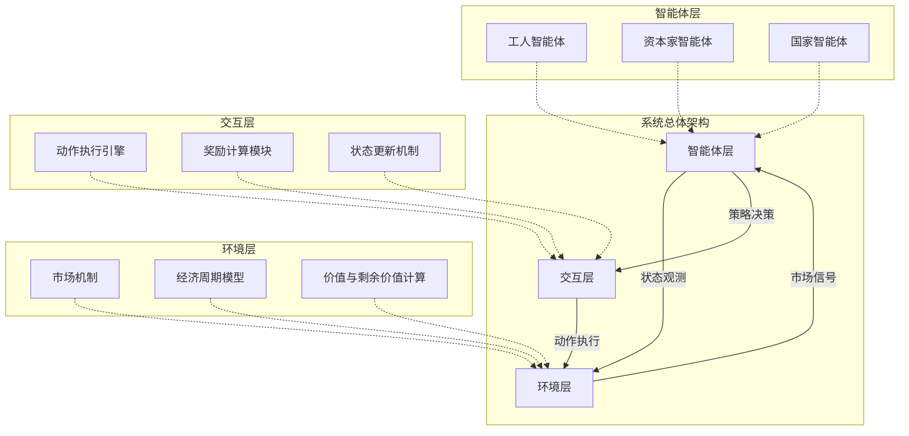

---

## 各组件Agent内部结构框架

### 工人智能体（Worker Agent）结构

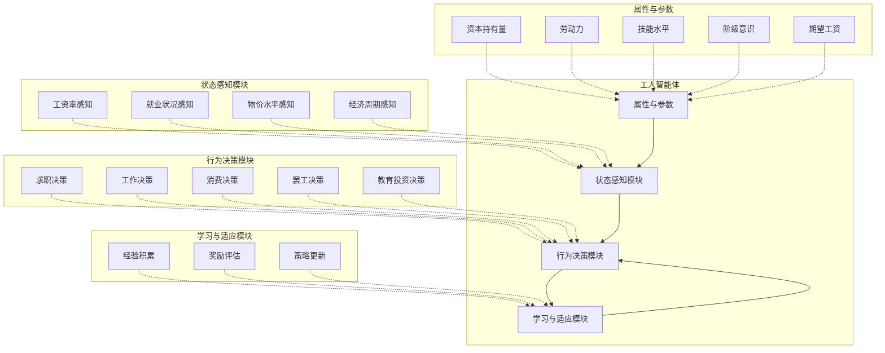

### 资本家智能体（Capitalist Agent）结构

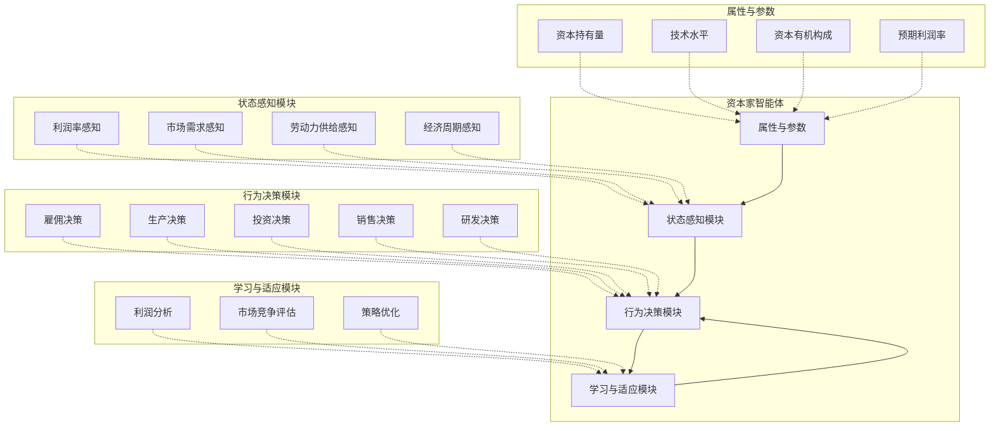

### 国家智能体（State Agent）结构

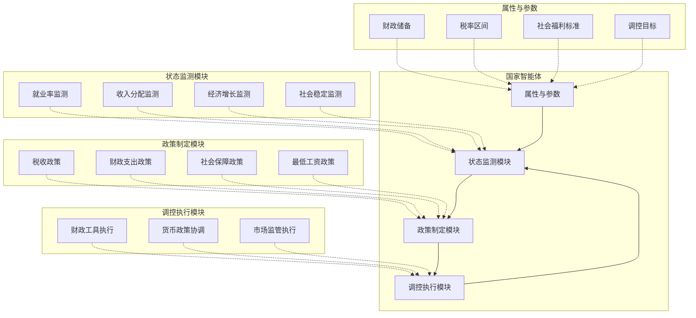

---

# 强化学习基础框架

系统采用了深度Q网络（Deep Q-Network, DQN）作为基础强化学习算法，每个经济主体（工人、资本家、国家）都是一个独立的DQN智能体。

## 强化学习算法简介

我们可以把强化学习想象成一种"试错学习法"，就像训练宠物一样。系统中的每个经济角色（工人、资本家、国家）都像是一个在学习的学生，他们在经济环境中不断地尝试各种行为，根据结果的好坏来调整自己的行为策略。

**基本运行逻辑**：

1. **观察环境**：每个智能体首先观察当前的经济状况，比如工资水平、商品价格、就业率等。
2. **做出决策**：基于观察到的信息，智能体会选择一个行动，比如工人决定找工作还是消费，资本家决定是否雇佣工人。
3. **执行行动**：智能体执行选定的行动，对经济环境产生影响。
4. **获得奖励**：根据行动的结果，智能体会得到一个"分数"（奖励），正分表示做得好，负分表示做得不好。
5. **学习改进**：智能体会记住这次经历，并根据奖励调整自己的行为策略，以便下次做得更好。

## 马尔可夫决策过程（MDP）建模

每个智能体的行为可以用马尔可夫决策过程来描述：

$$
 \mathcal{M} = (\mathcal{S}, \mathcal{A}, \mathcal{P}, \mathcal{R}, \gamma) 
$$
其中：

- $\mathcal{S}$：状态空间（观察到的经济环境状态）
- $\mathcal{A}$：动作空间（可选的经济行为）
- $\mathcal{P}(s'|s,a)$：状态转移概率
- $\mathcal{R}(s,a)$：奖励函数
- $\gamma \in [0,1]$：折扣因子

## Q-learning算法

系统采用Q-learning算法来学习最优策略：

$$
Q(s_t, a_t) \leftarrow Q(s_t, a_t) + \alpha \left[ r_{t+1} + \gamma \max_{a} Q(s_{t+1}, a) - Q(s_t, a_t) \right]
$$
其中：

- $Q(s,a)$：状态-动作值函数
- $\alpha$：学习率
- $r_{t+1}$：执行动作$a_t$后得到的即时奖励
- $\gamma$：折扣因子

## 深度Q网络（DQN）结构

系统使用了一种叫做深度Q网络（DQN）的算法，这是一种结合了深度学习和Q学习的方法：

- **神经网络大脑**：每个智能体都有一个"大脑"（神经网络），用来处理信息和做决策。
- **经验记忆**：智能体会把经历过的场景、采取的行动和得到的奖励存储起来，就像写日记一样。
- **反复练习**：智能体会时不时回顾过去的经历，从中总结经验教训，优化自己的决策能力。

### 神经网络架构

系统使用三层全连接神经网络作为Q函数的近似器：

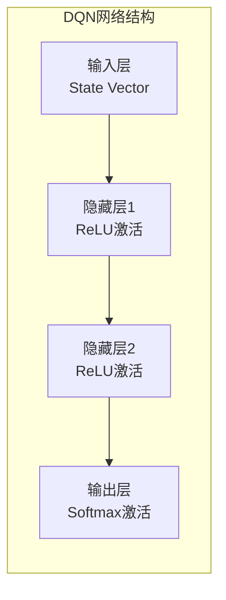

数学表达形式： 
$$
 Q(s,a;\theta) = \text{Softmax}\left( W_3 \cdot \text{ReLU}\left( W_2 \cdot \text{ReLU}\left( W_1 \cdot s + b_1 \right) + b_2 \right) + b_3 \right) 
$$
其中$\theta = {W_1,W_2,W_3,b_1,b_2,b_3}$是网络参数。

### 网络输入输出

- 输入层：状态向量$s \in \mathbb{R}^{n_s}$，维度为5 $$s = [\text{时间步}, \text{工资率}, \text{商品价格}, \text{就业率}, \text{总资本}]$$
- 输出层：动作价值$Q(s,\cdot;\theta) \in \mathbb{R}^{n_a}$，维度取决于智能体类型
  - 工人：$n_a=2$（找工作、工作和消费）
  - 资本家：$n_a=3$（雇佣、生产、销售）
  - 国家：$n_a=2$（税率调整、社会支出）

## DQN关键技术

### ε-贪婪探索策略

为了平衡探索与利用，系统采用ε-贪婪策略：

$$
 \pi(a|s) = \begin{cases} \text{random action}, & \text{with probability } \epsilon \\ \arg\max_a Q(s,a;\theta), & \text{with probability } 1-\epsilon \end{cases} 
$$
其中ε随训练过程衰减： $$ \epsilon_{t+1} = \max(\epsilon_{\min}, \epsilon_t \times \epsilon_{\text{decay}}) $$

初始值$\epsilon_0=1.0$，最小值$\epsilon_{\min}=0.01$，衰减率$\epsilon_{\text{decay}}=0.995$。

### 经验回放机制

为了避免数据相关性和策略变化过快的问题，系统采用经验回放机制：

1. 将经验元组$(s_t,a_t,r_t,s_{t+1},done)$存储在回放缓冲区$\mathcal{D}$中
2. 从缓冲区中随机采样一批经验用于训练

$$
 \mathcal{L}(\theta) = \mathbb{E}_{(s,a,r,s',done) \sim \mathcal{D}} \left[ \left( r + \gamma \max_{a'} Q(s',a';\theta^-) \cdot (1-done) - Q(s,a;\theta) \right)^2 \right] 
$$

其中$\theta^-$是目标网络的参数，定期从主网络复制。

### 目标网络

为了稳定训练过程，系统使用两个网络：

- 主网络：参数$\theta$，用于选择动作和计算$Q(s,a;\theta)$
- 目标网络：参数$\theta^-$，用于计算目标值$r + \gamma \max_{a'} Q(s',a';\theta^-)$

目标网络参数定期更新： $$ \theta^- \leftarrow \theta $$

---

## 多智能体强化学习（MARL）框架

在现实经济中，不是只有一个人在做决策，而是有很多不同的参与者在同时行动。这就是多智能体强化学习的意义所在。

### 独立学习者框架（Independent Learners）

系统采用独立学习者框架，每个智能体独立学习自己的策略：

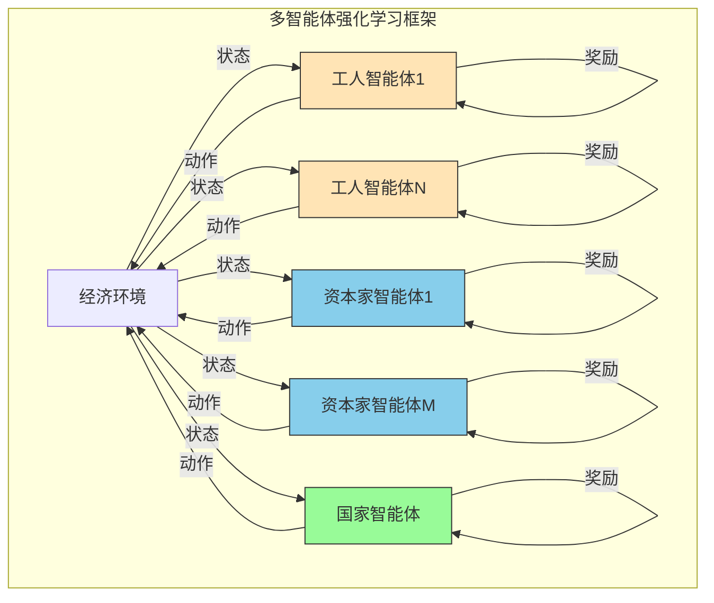

### 运行逻辑

1. **并行决策**：在同一时刻，所有的工人、资本家和国家都会同时观察环境并做出决策。
2. **环境整合**：系统会把所有智能体的行动汇总起来，计算对整个经济环境的影响。
3. **个性化奖励**：每个智能体根据自己在经济中的地位和目标获得相应的奖励。
4. **独立学习**：虽然大家都在同一个经济环境中，但每个智能体都是独立学习和优化自己的策略。

举个例子，当多个工人同时决定找工作，而多个资本家同时决定雇佣工人时，系统会匹配供需关系，影响就业率和工资水平，然后每个参与者根据结果获得各自的奖励。

### 训练流程

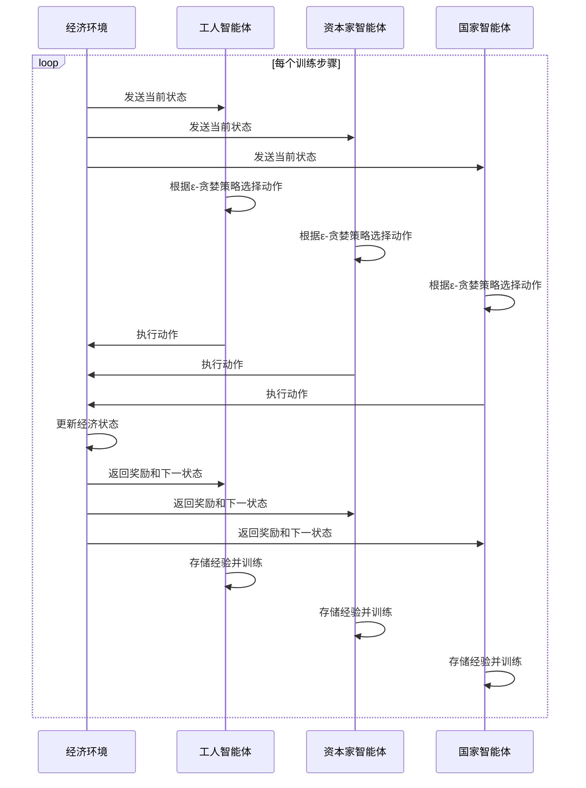

---

## 奖励函数设计

### 工人奖励函数

$$
 R_{\text{worker}} = \begin{cases} \text{wage} - c_{\text{living}}, & \text{employed} \\ c_{\text{unemployment}}, & \text{unemployed} \end{cases} 
$$

其中$c_{\text{living}}$是生活成本，$c_{\text{unemployment}}$是失业惩罚。

### 资本家奖励函数

```math
 R_{\text{capitalist}} = \frac{\text{profit}}{\text{normalization factor}} = \frac{(\text{goods price} \times production - \text{wage rate} \times labor)}{100} 
```


### 国家奖励函数

```math
 R_{\text{state}} = w_1 \times \text{employment rate} + w_2 \times \frac{\text{total capital}}{normalization factor} 
```

其中$w_1,w_2$是权重系数。

---

## 训练过程详解

整个训练过程可以概括为以下几个步骤：

1. **初始化**：创建环境和智能体，初始化网络参数和回放缓冲区
2. **交互**：智能体与环境交互，收集经验
3. **存储**：将经验存储到回放缓冲区
4. **学习**：从缓冲区采样，更新Q网络参数
5. **衰减**：降低探索率ε
6. **重复**：重复步骤2-5直到训练完成

这种强化学习模型使各个经济主体能够通过试错学习，在复杂的经济环境中找到有利于自己利益的行为策略，从而展现出马克思主义经济学所描述的资本主义经济的动态演化过程。

---

## 数学模型表达

### 核心经济关系

基于马克思政治经济学理论，系统建立了如下核心数学关系：

$$
V = f(L)
$$
其中 $V$ 代表商品价值，$L$ 代表社会必要劳动时间。

$$
S = V - W
$$
其中 $S$ 代表剩余价值，$W$ 代表可变资本（工资）。

$$
r = \frac{S}{C+V}
$$
其中 $r$ 代表利润率，$C$ 代表不变资本，$V$ 代表可变资本。

$$
\text{org comp} = \frac{C}{V}
$$
其中 $\text{org comp}$ 代表资本有机构成。

### 阶级意识与集体行动模型

$$
P_{\text{strike}} = P_0 + (1 - \text{consciousness}) \times k
$$

其中 $P_{\text{strike}}$ 是工人罢工概率，$\text{consciousness}$ 是阶级意识水平。

### 市场价格机制

$$
P_{t+1} = \frac{D_t + S_t}{2}
$$

其中 $P$ 是价格，$D$ 是需求，$S$ 是供给。

### 经济周期转换条件

系统使用四阶段经济周期模型，转换条件如下：

- 扩张→危机：当 $\text{org-comp} > \theta_1$ 或失业率 $> \theta_2$
- 危机→萧条：债务去化完成
- 萧条→复苏：就业率回升且结构调整完成
- 复苏→扩张：投资活跃且充分就业

---

## 系统的合理性和现实性

这套系统在多个方面体现了高度的合理性和现实性：

### 理论基础扎实

系统严格按照马克思主义政治经济学的基本原理设计，包括：

- 劳动价值论：商品的价值由劳动决定
- 剩余价值理论：资本家通过剥削工人获得剩余价值
- 资本积累理论：利润的一部分用于扩大再生产
- 经济周期理论：经济会在繁荣、危机、萧条、复苏之间循环

### 行为逻辑真实

每个智能体的行为都贴近现实：

- 工人会因为待遇差而罢工，会为了未来投资教育
- 资本家会追求利润最大化，会在盈利好时扩张，困难时收缩
- 政府会关注就业和通胀，在两者间寻求平衡

### 经济规律符合实际

系统能够模拟出许多现实经济现象：

- 技术进步导致的失业（机器替代人工）
- 资本有机构成提高带来的利润率下降压力
- 经济周期的自发形成
- 收入分配差距的扩大趋势

### 学习机制先进

通过强化学习算法，智能体能够在实践中不断优化自己的策略，就像现实中的人们会根据经验调整行为一样。

**现实性体现**

1. **经济行为的真实模拟**：
   - 工人在失业时会积极找工作，有工作时会消费，这符合常理。
   - 资本家会根据盈利情况决定是否扩张或收缩，也非常现实。
   - 国家会根据经济指标调整政策，就像现实中的政府一样。
2. **经济规律的体现**：
   - 系统能模拟出供需关系对价格的影响。
   - 能表现出技术进步对就业结构的影响。
   - 能体现出经济周期的波动特征。
3. **复杂互动的展现**：
   - 不同智能体之间的互动会产生复杂的经济现象，比如当很多资本家都投资自动化设备时，可能导致工人失业率上升。
   - 政策调整会对整个经济系统产生连锁反应。

---

## 实际应用意义

这套系统就像一个经济政策的试验场，可以在虚拟环境中测试各种政策的效果，而无需在现实中承担风险。例如：

- 可以模拟提高最低工资标准对就业的影响
- 可以测试不同的税收政策对收入分配的影响
- 可以观察金融政策对经济周期的调节作用

通过这种方式，研究人员和政策制定者可以更好地理解经济系统的运行规律，制定出更有效的经济政策。

总的来说，这套系统通过先进的强化学习算法，成功地模拟了一个复杂的经济社会，既有坚实的理论基础，又有很强的现实意义，是一个非常有价值的研究工具。

---

# 强化学习算法介绍

## 为什么选择强化学习？

想象一下：你正在玩一个全新的游戏，没有人教你规则。你会怎么做？你可能会：
- 尝试按各种按键看看会发生什么
- 记住哪些操作能得分，哪些会扣分
- 逐渐总结出一些“套路”

**这，就是强化学习的基本思想！**

在我们的经济模拟系统中，选择强化学习有三大合理性：

---

### **与现实经济行为高度相似**

**现实中的学习过程：**
- 工人第一次找工作：不知道要多少钱合适 → 尝试要个工资 → 成功了或失败了 → 下次调整
- 资本家决定投资：不知道市场反应 → 投资试试 → 赚钱了或亏本了 → 调整策略
- 政府调整政策：不知道效果如何 → 出台政策 → 看经济反应 → 优化政策

**系统的学习过程：**

- 智能体尝试行动 → 得到“奖励”（正分或负分）→ 记住经验 → 下次做得更好

**这完全是模仿现实中人们“从经验中学习”的过程！**

---

### **不同角色有不同的“游戏规则”**

在同一个经济环境中，不同角色的目标完全不同：

| 角色       | 主要目标           | 好比在玩什么游戏                   |
| ---------- | ------------------ | ---------------------------------- |
| **工人**   | 赚钱生活，不被饿死 | **生存游戏**：平衡收入与支出       |
| **资本家** | 利润最大化         | **经营游戏**：用最小成本赚最大利润 |
| **国家**   | 社会稳定，经济增长 | **平衡游戏**：在各种指标间找平衡点 |

强化学习让每个角色都能**独立学习自己的最优策略**，就像现实一样——工人不会去学如何当资本家，资本家也不会去学如何当政府官员。

---

### **动态适应复杂环境**

经济环境是**时刻变化的**：
- 工资水平会变
- 商品价格会变
- 就业率会变
- 政策会变

传统的固定规则系统很难应对这种变化，而强化学习智能体能够：
- 持续观察环境变化
- 调整自己的行为策略
- 在变化中寻找新机会

**就像现实中人们会“与时俱进”一样！**

---

## 算法逻辑通俗解读

让我们把复杂的算法逻辑拆解成容易理解的概念：

### 概念1：**“试错学习”三步骤**

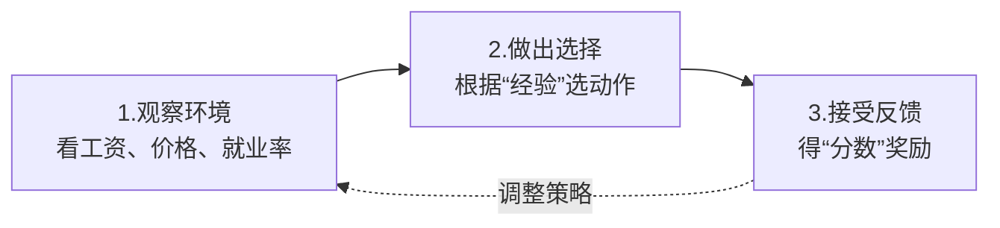

**比如一个工人：**
1. **观察**：看到市场工资是每月5000元
2. **选择**：决定接受这个工作
3. **反馈**：
   - 如果每月能存下钱 → **正分**（做得好！）
   - 如果入不敷出 → **负分**（要调整！）

---

### 概念2：**“大脑”——神经网络**

每个智能体都有一个“**虚拟大脑**”（神经网络）：

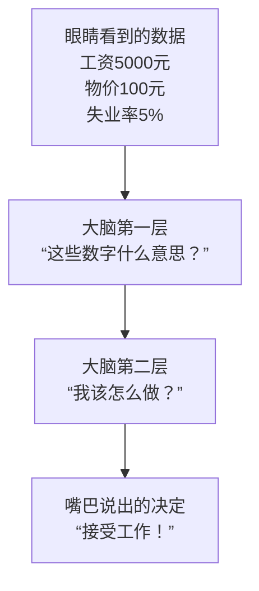

**这个大脑的神奇之处在于：**
- 一开始是“**婴儿大脑**”——乱做决定
- 通过不断“**考试**”（尝试+反馈）→ 大脑变聪明
- 最终变成“**专家大脑**”——能做出明智决策

**就像现实中：**
- 新手员工 → 经常犯错 → 从错误中学习 → 成为老手

---

### 概念3：**“记忆库”——经验回放**

智能体会把经历的事情记在“**日记本**”里：

| 日期  | 看到了什么 | 做了什么 | 结果如何     | 学到了什么   |
| ----- | ---------- | -------- | ------------ | ------------ |
| 第1天 | 工资5000   | 接受工作 | 存了1000元 ✓ | 这个工资不错 |
| 第2天 | 工资3000   | 拒绝工作 | 继续找工作 ✓ | 太低了不划算 |
| 第3天 | 工资8000   | 接受工作 | 反而欠债 ✗   | 物价太高了！ |

**为什么要记日记？**
- 避免“**好了伤疤忘了疼**”——记住失败教训
- 可以“**温故知新**”——随时复习过去经验
- 学习更全面——不只依赖最近几天的经验

---

### 概念4：**“探索与利用”的平衡**

这是最聪明的设计！智能体不会：

❌ **只做“安全”选择**（太保守，错过机会）

❌ **只做“冒险”尝试**（太激进，经常失败）

而是采用 **ε-贪婪策略**：

**比如：**

- 大部分时间（95%）：选择过去证明有效的方法
- 小部分时间（5%）：随机尝试完全新的做法

**这多么像现实中的我们！**
- 通常按经验办事
- 偶尔尝试新方法（比如换工作、投资新项目）
- 如果新方法好 → 加入经验库
- 如果新方法差 → 继续用老方法

---

## 多智能体框架的巧妙之处

### 场景模拟：劳动力市场的一天

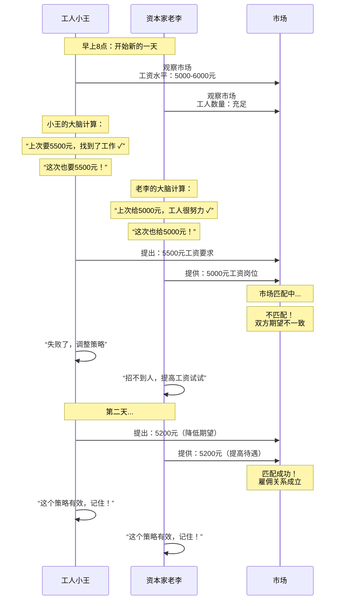

**这个场景展示了系统的核心优势：**

1. **动态互动**：不是预设的剧本，而是真正的互动博弈
2. **自我调节**：市场通过智能体的学习自动调节
3. **渐进优化**：从混乱到有序的进化过程

---

## 奖励函数：经济的“指挥棒”

每个角色有不同的“**得分标准**”：

### 工人的得分卡：
```python
if 有工作:
    分数 = 工资 - 生活成本
    # 比如：工资5000 - 生活成本4000 = +1000分 ✓
else:
    分数 = 失业惩罚（比如-500分）
    # 比如：没工作 = -500分 ✗
```

### 资本家的得分卡：
```python
分数 = （商品价格 × 产量 - 工资成本） ÷ 100
# 比如：(10元×1000件 - 5000元工资) ÷ 100 = +50分 ✓
```

### 国家的得分卡：
```python
分数 = 就业率×权重1 + 总资本×权重2
# 比如：95%就业率 + 经济总量 = 高分 ✓
```

**这个设计为什么合理？**
- **符合现实目标**：工人关心温饱，资本家关心利润，国家关心稳定
- **引导正确行为**：高分数引导智能体做“正确”的事
- **可量化评估**：用数字衡量“做得好不好”

---

## 整个训练过程：从“经济婴儿”到“经济专家”

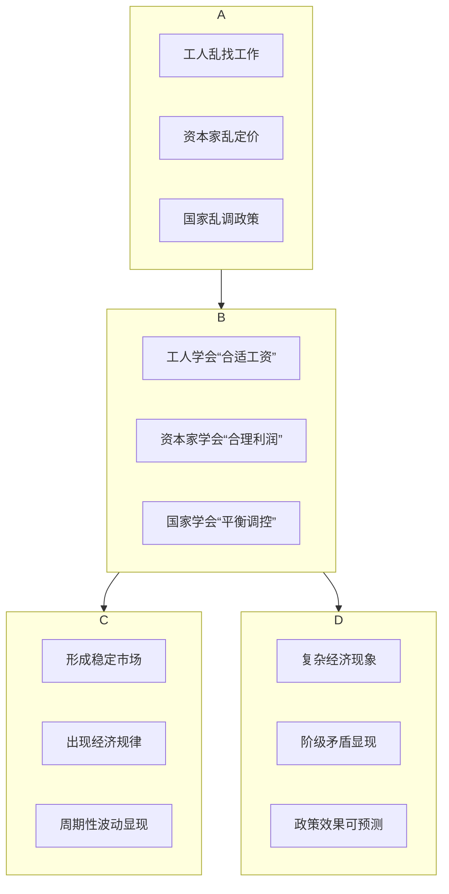

**这个过程完美模拟了：**

1. **原始经济** → **现代经济** 的发展
2. **个人理性** → **集体规律** 的涌现
3. **简单系统** → **复杂系统** 的演化

---

## 为什么这套算法特别适合经济模拟？

### 1. **个体差异性的体现**
现实中每个人都是不同的：有的工人胆大，有的保守；有的资本家激进，有的稳健。强化学习智能体通过不同的初始参数和不同的学习路径，自然形成了个体差异。

### 2. **策略的多样性**
系统不会产生“唯一最优解”，而是：
- **不同情境下**有不同的最优策略
- **不同角色间**有相互制约的策略
- **随时间演进**策略会不断调整

**就像现实中：**
- 经济好时，工人要求高工资
- 经济差时，工人接受低工资
- 资本家在人力贵时多用机器
- 资本家在人力便宜时多用人工

### 3. **意外现象的涌现**
最神奇的是：很多经济现象不是程序预设的，而是**自然涌现**的！

比如：
- **经济周期**：不是设定的，而是智能体互动产生的
- **贫富分化**：不是强制的，而是资本积累的自然结果
- **阶级矛盾**：不是灌输的，而是利益冲突的必然产物

### 4. **政策实验的安全性**
现实中：
- 政策失误 → 经济危机 → 人民受苦
- 政策调整 → 需要数年验证效果

在系统中：
- 可以随意测试各种政策
- 立即看到长期效果
- 零风险找出最优方案

---

## 总结：算法为什么“聪明”又“合理”？

| 算法特性       | 现实对应         | 合理性体现               |
| -------------- | ---------------- | ------------------------ |
| **试错学习**   | 从经验中成长     | 人类学习的基本方式       |
| **个性化目标** | 不同人有不同追求 | 社会角色的多样性         |
| **动态适应**   | 与时俱进         | 经济环境的不断变化       |
| **记忆积累**   | 经验传承         | 人类的知识积累           |
| **探索创新**   | 尝试新事物       | 社会进步的动力           |
| **互动博弈**   | 社会关系         | 经济的本质是人与人的互动 |

**最终效果：**
> 这个系统就像一个“**经济培养皿**”，我们放入简单的规则（马克思经济原理）和基础的学习能力（强化学习），然后看着它自己“**长**”出一个复杂的经济社会——有繁荣有危机，有剥削有反抗，有政策有市场……而这一切都不是我们预先编好的剧本，而是系统自己“**演**”出来的。

**这才是最像现实的地方：**
现实经济不是上帝设计的，而是亿万人在互动中自发形成的。我们的系统用算法再现了这个神奇的过程——从简单规则中涌现出复杂现象，从个体理性中产生集体规律。

这套算法让马克思的经济理论“**活**”了起来，让我们能够真正地“**看到**”剩余价值如何产生、“**感受**”到经济周期如何波动、“**理解**”阶级矛盾如何演化。它不仅是理论的验证工具，更是理解现实的强大透镜。

---

# 三大智能体内部算法

## 工人智能体：数字化的“打工人”

### 算法核心逻辑：生存与发展的平衡游戏

**想象一个工人的一天：**
```python
class WorkerBrain:
    def decide_what_to_do(self):
        if self.money < 生存底线:
            return "拼命找工作"
        elif self.工资 < 期望工资 and self.技能可提升:
            return "投资学习"
        elif self.工作太累 or self.工资太低:
            return "考虑罢工"
        else:
            return "正常工作+合理消费"
```

---

### 算法模块详解

#### **状态感知模块（工人的“眼睛和耳朵”）**

**工人感知的经济信号：**

| 感知项目         | 现实意义               | 算法处理                   |
| ---------------- | ---------------------- | -------------------------- |
| **工资率感知**   | “市场上现在给多少钱？” | 收集最近10份工作的平均工资 |
| **就业状况感知** | “工作好找吗？”         | 计算朋友中找到工作的比例   |
| **物价水平感知** | “生活成本涨了吗？”     | 跟踪一篮子商品价格变化     |
| **经济周期感知** | “现在经济形势怎么样？” | 观察新闻、政策、市场氛围   |

**智能之处：**
- 不只关注**绝对数值**（工资5000元）
- 更关注**相对变化**（比上个月涨了还是降了？）
- 还会**对比参考**（朋友工资多少？物价涨幅多少？）

**就像现实中的工人：**
> 小王听到新闻说“经济下行”，看到楼下餐馆倒闭，感受公司减少加班……这些信息汇总后告诉他：“现在找工作要降低期望。”

---

#### **行为决策模块（工人的“大脑”）**

这是一个**多目标优化问题**，工人要在以下目标中平衡：

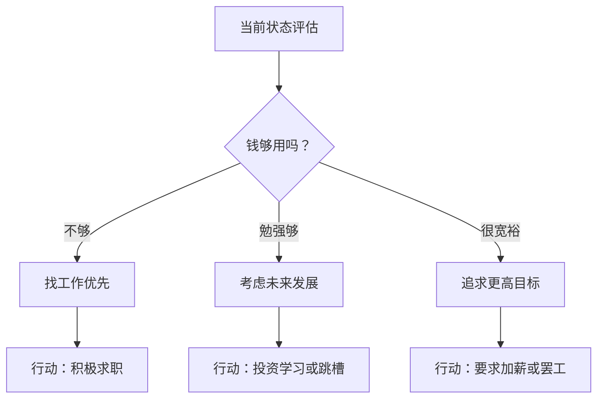

**具体决策逻辑：**

**（1）求职决策算法：**
```python
def 决定期望工资():
    市场平均 = 收集最近工资数据()
    个人经验 = 自己过去工资的历史记录
    紧急程度 = 计算(存款/每月开销)
    
    if 紧急程度 < 1:  # 快没钱了
        期望工资 = 市场平均 * 0.9  # 降低要求
    else:
        期望工资 = max(市场平均, 上次工资*1.05)  # 期望涨薪
    
    return 期望工资
```

**合理性体现：**
- **紧急时降低要求**：快没钱了，先有工作再说
- **宽裕时提高要求**：有存款时，可以慢慢找更好的
- **期望持续增长**：希望每次换工作都涨薪

---

**（2）消费决策算法：**
```python
def 决定消费多少():
    必要消费 = 房租 + 食物 + 交通
    可支配收入 = 工资 - 必要消费
    
    if 可支配收入 > 1000:
        # 有一定储蓄基础
        if 年龄 < 30:
            额外消费 = 可支配收入 * 0.3  # 年轻人更多消费
        else:
            额外消费 = 可支配收入 * 0.2  # 年长者更多储蓄
    else:
        额外消费 = 可支配收入 * 0.1  # 手头紧时节省
    
    return 必要消费 + 额外消费
```

**现实性体现：**
- **年龄影响消费观**：年轻人更爱消费，年长者更爱储蓄
- **收入影响消费力**：收入高时消费比例反而可能降低
- **保留基本储蓄**：总有“应急钱”的观念

---

**（3）罢工决策算法：**（最复杂的社会行为模拟）
```python
def 是否参与罢工():
    # 个人因素
    个人不满 = (期望工资 - 实际工资) / 期望工资
    个人风险承受 = 根据(年龄、家庭负担、储蓄)计算
    
    # 社会因素
    同事参与率 = 计算同事中打算罢工的比例
    阶级意识 = 学习历史中罢工成功率的影响
    社会支持度 = 观察媒体报道倾向
    
    # 综合计算
    罢工倾向 = 个人不满 * 0.4 + 同事参与率 * 0.3 + 阶级意识 * 0.2 + 社会支持度 * 0.1
    
    if 罢工倾向 > 个人风险承受 * 阈值:
        return "参与罢工"
    else:
        return "继续工作"
```

**深刻的社会性：**
这个算法捕捉了**集体行动的逻辑**：
- **从众效应**：别人都罢工，我也更可能参与
- **风险评估**：考虑个人情况，不是盲目跟风
- **历史学习**：从过去罢工结果中吸取教训

---

#### **学习与适应模块（工人的“经验积累”）**

**算法如何“成长”：**

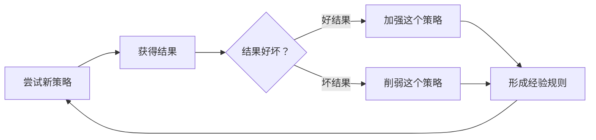

**具体学习过程：**
> 例子：小张尝试要求6000元工资

1. **第一次**：要求6000元 → 找到工作 ✓ → **记住**：“这个要求可行”
2. **第二次**：要求6000元 → 没找到工作 ✗ → **调整**：“现在市场变了”
3. **第三次**：要求5500元 → 立刻找到工作 ✓ → **更新**：“这个时机5500元合适”

**特殊的学习：阶级意识成长**
```python
def 更新阶级意识():
    个人经历 = 统计(被拒绝次数 + 工资被压榨次数)
    社会观察 = 关注(贫富差距新闻 + 罢工结果)
    
    阶级意识 += 个人经历 * 0.001 + 社会观察 * 0.0005
    阶级意识 = min(阶级意识, 1.0)  # 不超过1
    
    return 阶级意识
```

**阶级意识会如何影响行为？**
- 意识低时：只关注个人利益，“各扫门前雪”
- 意识中等：开始关注同事待遇，愿意联合
- 意识高时：为集体利益行动，参与工会斗争

---

### 工人智能体的现实性总结

1. **不是简单的“追求最大化”**：工人不只是要工资最高，还要考虑工作稳定性、发展空间、工作强度等多维度平衡。

2. **有限理性**：工人不能知道所有信息，只能根据有限信息决策，有时会做出“看起来不理性”但符合当时认知的选择。

3. **社会性动物**：决策深受他人影响，从同事、朋友、社会氛围中获得信号。

4. **学习能力有限**：不是一下子变聪明，而是缓慢积累经验，可能会犯重复错误。

---

## 资本家智能体：数字化的“企业家”

### 算法核心逻辑：利润机器的优化引擎

**资本家的核心矛盾：**
```python
class CapitalistBrain:
    def 永恒的矛盾():
        # 马克思揭示的资本家根本矛盾
        矛盾 = {
            "短期利润" vs "长期发展",
            "压低工资" vs "保持工人积极性",
            "投资机器" vs "保留人工",
            "扩大生产" vs "避免生产过剩"
        }
        return 寻找平衡点(矛盾)
```

---

### 算法模块详解

#### **状态感知模块（资本家的“商业雷达”）**

**资本家关注的关键指标：**

| 指标               | 现实意义                 | 算法关注点                     |
| ------------------ | ------------------------ | ------------------------------ |
| **利润率感知**     | “生意赚不赚钱？”         | 当前利润率、趋势、行业对比     |
| **市场需求感知**   | “东西好卖吗？”           | 订单量、库存周转率、价格弹性   |
| **劳动力供给感知** | “工人好招吗？”           | 求职者数量、工资要求、技能匹配 |
| **经济周期感知**   | “现在是扩张还是收缩期？” | 政策风向、同行动态、信贷环境   |

**智能感知的特点：**
- **数据驱动**：不只凭感觉，看财务报表
- **前瞻性**：预测未来趋势，不只是看当下
- **比较分析**：对比同行，找出优劣势

**就像现实中的企业家：**
> 李老板看到：1）产品库存增加，2）同行降价促销，3）工人要求涨薪。综合判断：“市场可能要转向，需要调整策略。”

---

#### **行为决策模块（资本家的“战略室”）**

**资本家的多目标决策树：**

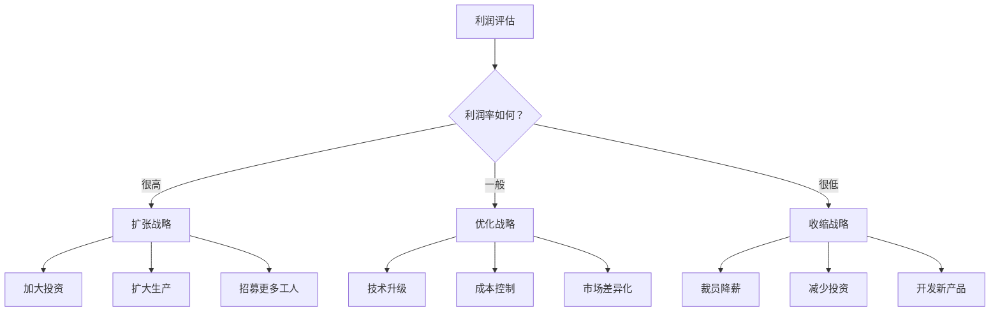

---

**具体决策算法：**

**（1）雇佣决策算法：**

```python
def 决定雇佣多少人():
    # 生产需求
    订单量 = 未来3个月预测订单()
    当前产能 = 工人数 * 人均产出
    
    # 成本考虑
    工资成本 = 市场工资 * 考虑人数
    机器替代 = 计算(机器成本/节省工资)
    
    # 马克思核心：资本有机构成决策
    if 机器成本/机器寿命年节约工资 < 3:  # 3年回本
        选择 = "买机器"  # 提高资本有机构成
        雇佣人数 = max(0, 订单量/人均产出 - 当前工人数)
    else:
        选择 = "雇工人"  # 保持或降低有机构成
        雇佣人数 = 订单量/人均产出 * 1.1  # 留10%余量
    
    return 雇佣人数, 选择
```

**资本有机构成的现实体现：**
- **技术革命期**：机器便宜且高效 → 大量买机器，少雇工人
- **人力便宜期**：工资低，工人充足 → 多雇工人，少买机器
- **平衡期**：机器和工人按比例配置

这正是马克思分析的**技术替代劳动**的过程！

---

**（2）定价决策算法：**（马克思价值规律的数字实现）
```python
def 决定商品价格():
    # 劳动价值计算（马克思核心）
    社会必要劳动时间 = 行业平均生产时间()
    价值 = 社会必要劳动时间 * 单位时间价值
    
    # 市场供需调整
    市场供需比 = 总需求 / 总供给
    供需系数 = min(max(市场供需比, 0.8), 1.2)  # 在0.8-1.2之间
    
    # 竞争策略
    如果是垄断 = 有专利或独特技术
    if 如果是垄断:
        价格 = 价值 * 1.5  # 垄断高价
    else:
        # 完全竞争，价格围绕价值波动
        价格 = 价值 * 供需系数 * (0.9 + random()*0.2)  # 90-110%波动
    
    return 价格
```

**完美体现价值规律：**
价格不会偏离价值太远，总是围绕价值波动，这正是马克思描述的**价值规律**！

---

**（3）投资决策算法：**（利润率下降规律的体现）
```python
def 是否投资新技术():
    当前利润率 = 当前利润 / 总资本
    预期新利润率 = 预测(投资后利润) / (总资本+投资额)
    
    # 马克思的利润率下降趋势
    历史利润率 = 获取过去10期利润率()
    下降趋势 = 计算趋势线(历史利润率)
    
    if 预期新利润率 > 当前利润率 and 预期新利润率 > 下降趋势预测值:
        return "投资"
    elif 当前利润率 < 行业平均 and 下降趋势明显:
        return "必须投资！否则被淘汰"
    else:
        return "暂不投资"
```

**马克思的深刻洞察：**
资本家被**无形的手**推动：
1. 不投资新技术 → 成本高 → 被淘汰
2. 投资新技术 → 暂时提高利润率
3. 但大家都投资 → 行业技术进步 → 社会必要劳动时间减少 → 价值下降 → **利润率又下降！**

这就是**利润率趋向下降规律**的算法体现！

---

#### **学习与适应模块（资本家的“商学院”）**

**资本家的特殊学习：危机应对**

```python
def 从危机中学习():
    if 刚经历经济危机:
        损失程度 = 计算(危机中损失)
        
        if 损失程度 > 阈值:
            # 惨痛教训！
            学习到 = {
                "减少负债": 负债率 * 0.8,
                "增加现金": 现金储备 * 1.5,
                "分散风险": 投资组合多样化
            }
        else:
            # 侥幸过关，可能不够警惕
            学习到 = {
                "危机不可怕": 保持原策略
            }
    
    return 学习到
```

**资本家学习的现实特点：**
- **路径依赖**：成功经验会被过度使用
- **风险偏好差异**：有的激进，有的保守
- **从失败中学习**：但可能矫枉过正

---

### 资本家智能体的深刻性总结

1. **不是简单的“利润最大化机器”**：要在短期利润与长期生存、技术进步与社会稳定间平衡。

2. **被规律驱使**：看似自由决策，实则被价值规律、利润率下降规律等客观规律约束。

3. **创新与破坏**：技术进步带来发展，但也破坏旧产业、造成失业。

4. **阶级立场**：本能地压低工资、延长工时，但又被工人反抗制约。

---

## 国家智能体：数字化的“政府”

### 算法核心逻辑：社会平衡的艺术

**政府的根本任务：**
```python
class GovernmentBrain:
    def 核心使命():
        return 平衡([
            "经济发展",
            "社会稳定", 
            "社会公平",
            "财政收入"
        ])
```

---

### 算法模块详解

#### **状态监测模块（政府的“统计局”）**

**政府监控的核心指标：**

| 监测维度         | 算法实现                     | 现实对应           |
| ---------------- | ---------------------------- | ------------------ |
| **就业率监测**   | 实时计算有工作人数/总劳动力  | 每月公布的就业数据 |
| **收入分配监测** | 基尼系数计算、工资中位数     | 贫富差距统计       |
| **经济增长监测** | GDP增长率、工业产出指数      | 季度经济数据       |
| **社会稳定监测** | 罢工次数、抗议规模、舆论情绪 | 社会稳定评估       |

**监测的智能性：**
- **多维度综合**：不只单一指标，看整体平衡
- **预警机制**：设置红线，提前预警
- **区域差异**：不同地区不同监测标准

---

#### **政策制定模块（政府的“决策智囊团”）**

**政策的自动生成逻辑：**

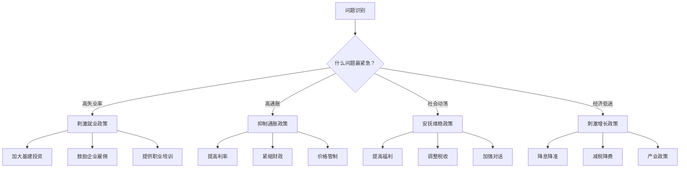

---

**具体政策算法：**

**（1）税收政策算法：**（平衡财政收入与经济发展）
```python
def 调整税率():
    # 财政收入压力
    财政赤字 = 支出 - 收入
    赤字率 = 财政赤字 / GDP
    
    # 经济刺激需求
    经济增长率 = 最近4季度平均()
    失业率 = 当前失业率
    
    # 贫富差距考虑
    基尼系数 = 计算收入差距()
    
    if 赤字率 > 0.03 and 经济增长率 > 0.05:
        # 经济好但有赤字
        if 基尼系数 > 0.4:
            return "提高高收入税率"  # 既增收又调节分配
        else:
            return "小幅提高标准税率"
    
    elif 经济增长率 < 0.03 or 失业率 > 0.06:
        # 经济需要刺激
        return "降低企业所得税，鼓励投资"
    
    else:
        return "保持税率稳定"
```

**政策的渐进性：**
- 不大幅突变，避免经济震荡
- 小步调整，观察效果
- 多种工具组合使用

---

**（2）最低工资政策算法：**（阶级调和的工具）
```python
def 调整最低工资():
    # 工人生活保障
    基本生活成本 = 计算一篮子商品价格()
    工人平均工资 = 当前工人工资中位数
    
    # 企业承受能力
    企业平均利润率 = 行业利润率()
    小微企业生存状况 = 调查()
    
    # 国际比较
    国际水平 = 获取类似国家最低工资/GDP比例
    
    # 计算公式
    理论最低工资 = 基本生活成本 * 1.3  # 留30%余量
    
    if 企业平均利润率 > 0.1 and 工人平均工资/理论最低工资 > 1.5:
        # 企业盈利好，工人工资高
        return 提高最低工资(理论最低工资)
    
    elif 小微企业生存状况 < 0.5:  # 50%小微企业困难
        return 暂不调整或小幅调整
    
    else:
        return 按通胀率调整
```

**最低工资的阶级调和作用：**
- 太低：工人无法生存 → 社会不稳定
- 太高：企业倒闭 → 失业增加 → 也不稳定
- 适度：保障工人基本生活，让企业能生存

**这正是国家在阶级矛盾中的调节角色！**

---

**（3）社会保障政策算法：**（危机缓冲器）
```python
def 决定失业救济金():
    # 财政能力
    财政盈余 = 财政收入 - 必需支出
    可支配资金 = 财政盈余 * 0.3  # 最多用30%盈余
    
    # 社会需求
    失业率 = 当前失业率
    长期失业比例 = 失业超过6个月人数 / 总失业
    
    # 经济周期
    if 经济阶段 == "危机期" or "萧条期":
        # 危机时提高救济，稳定社会
        救济金 = 平均工资 * 0.6  # 提高到60%
        期限 = 24  # 延长到24个月
    else:
        # 正常时期
        救济金 = 平均工资 * 0.4  # 40%工资
        期限 = 12  # 12个月
    
    # 防止福利依赖
    if 长期失业比例 > 0.3:
        # 太多人长期依赖，调整政策
        救济金 = 救济金 * 0.9  # 降低10%
        增加培训要求 = True
    
    return 救济金, 期限
```

**社会保障的双重功能：**
1. **人道主义**：不让失业者饿死
2. **经济稳定器**：维持基本消费，避免经济崩溃
3. **阶级矛盾缓冲**：减少社会冲突

---

#### **调控执行模块（政府的“工具箱”）**

**政策执行的艺术：**

| 调控工具     | 算法逻辑                 | 现实意义             |
| ------------ | ------------------------ | -------------------- |
| **财政工具** | 赤字率控制、支出结构调整 | 政府直接花钱影响经济 |
| **货币协调** | 利率调整、货币供应量     | 央行调节资金成本     |
| **市场监管** | 价格指导、垄断管制       | 防止市场失灵         |

**执行的关键原则：**
- **时机的艺术**：何时出手？过早浪费，过晚失效
- **力度的把握**：用力过猛有副作用，用力不足无效
- **政策的配合**：财政、货币、产业政策要协调

---

### 国家智能体的现实性总结

1. **不是万能的“上帝之手”**：政府只能在约束条件下优化，不能随心所欲。

2. **多重目标的平衡**：要在相互矛盾的目标间找到平衡点。

3. **信息不完全**：政府的决策基于不完全、有时滞的数据。

4. **政策效果的滞后性**：政策出台到见效需要时间，期间情况可能变化。

5. **阶级调停角色**：在工人和资本家之间寻找平衡，维持社会稳定。

---

## 三大智能体的互动：一幅完整的经济画卷

### 动态博弈过程

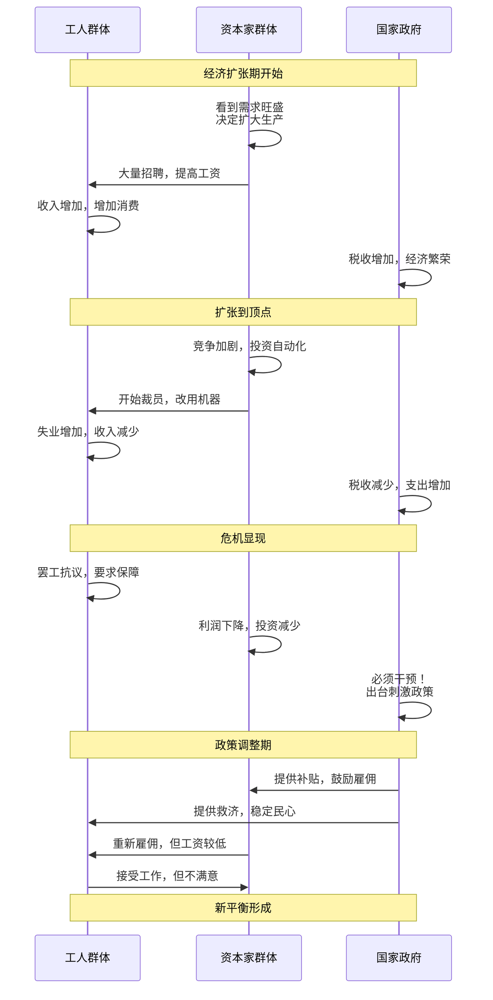

---

### 算法的深刻现实性

1. **个体理性与集体非理性**
   - 每个资本家都理性地投资自动化
   - 结果：全社会失业增加 → 需求下降 → 利润下降
   - 这就是**马克思的生产社会化与私人占有矛盾**！

2. **阶级矛盾的动态平衡**
   - 工人要求高工资 → 企业利润下降 → 投资减少 → 失业增加
   - 国家在其中调节：太高了压一压，太低了托一托

3. **经济周期的内生性**
   - 周期不是外生的，而是系统内生的
   - 是三大智能体互动的必然结果

4. **历史的路径依赖**
   - 今天的经济形态是昨天决策的结果
   - 明天的可能性受今天制约

---

## 为什么这个算法设计如此精妙？

1. **捕捉了经济的本质**

**经济不是物的关系，而是人的关系！**

- 工人与资本家的雇佣关系
- 资本家之间的竞争关系
- 国家与社会的管理关系

2. **体现了马克思的深刻洞见**

- **劳动价值论**：所有价值最终源于劳动
- **剩余价值论**：利润的本质是剩余价值
- **资本积累规律**：资本必然集中，贫困必然积累
- **经济周期理论**：危机是资本主义的必然产物

3. **算法的预测与解释力**

这个系统能**解释**现实中的经济现象：
- 为什么技术进步会导致失业？
- 为什么经济会周期性波动？
- 为什么贫富差距会扩大？
- 为什么政府要干预市场？

也能**预测**政策效果：
- 提高最低工资对就业的影响
- 减税对经济增长的刺激
- 利率调整对投资的引导

---

## 结语：数字化的政治经济学实验室

这套算法不是简单的游戏，而是**严肃的社会科学实验工具**。它让我们能够：

1. **在计算机里重现经济历史**：看看如果当年政策不同，结果会怎样？
2. **测试理论假设**：马克思的理论在数字世界里是否成立？
3. **预演政策效果**：在虚拟社会里先试错，再到现实实施。
4. **理解复杂互动**：看清个体行为如何汇聚成宏观现象。

**最精妙的是**：虽然每个智能体的算法都不复杂，但它们的互动却涌现出了极其复杂的经济现象——周期、危机、阶级斗争、政策演化……

**这就是复杂性科学的魅力**：简单规则产生复杂行为。

**这也是马克思主义的生命力**：150年前的理论，不仅能在现实世界中解释历史，还能在数字世界里预测未来。

这套算法让我们能够真正地、动态地、互动地**理解**政治经济学，而不仅仅是背诵教科书上的结论。它是一场思想的实验，一次理论的验证，一幅用代码绘制的经济画卷。