# 软件开发实践大作业实验报告

[TOC]

## 项目简介

### 项目名称

**XMU_Animals（校园动物关爱系统）**

### 项目描述

校园小动物守护者平台(XMU_Animals)是一个专为校园内流浪动物管理和保护而设计的综合管理系统。该平台旨在通过数字化手段追踪、记录和管理校园内的流浪动物信息，包括动物的基本档案、健康状况、喂养记录和位置信息等。

该系统采用前后端分离架构，后端使用Spring Boot框架构建RESTful API服务，前端采用Vue.js框架开发响应式用户界面。数据库设计围绕四个核心实体展开：动物(Animal)、喂养记录(Feeding)、健康记录(HealthRecord)和目击记录(Sighting)，形成了一个完整的动物信息管理体系。

### 项目组成员

| 姓名   | 学号           | 职责                                   | 负责部分                                       |
| ------ | -------------- | :------------------------------------- | :--------------------------------------------- |
| 邓凯璇 | 37220222203575 | 前后端开发 原型设计 报告撰写 | 原型设计 前端、后端、数据库 试验报告 |
|        |                |                                        |                                                |
|        |                |                                        |                                                |

---

## 项目逻辑设计

### 思维导图 - 分块展示

#### 系统整体架构

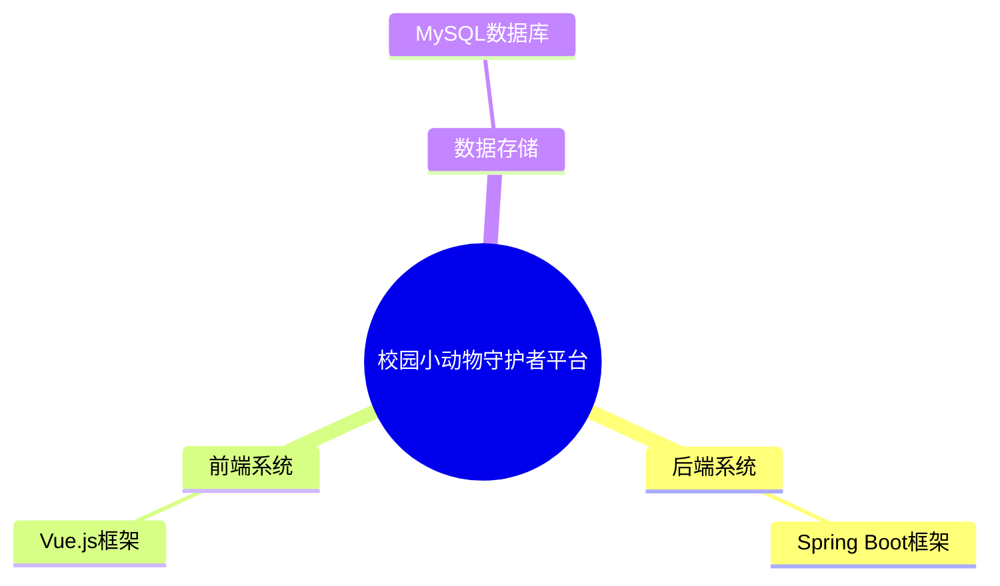

#### 后端详细结构

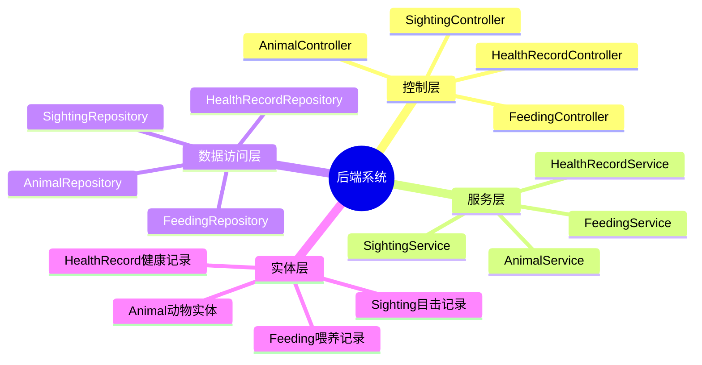

#### 前端详细结构

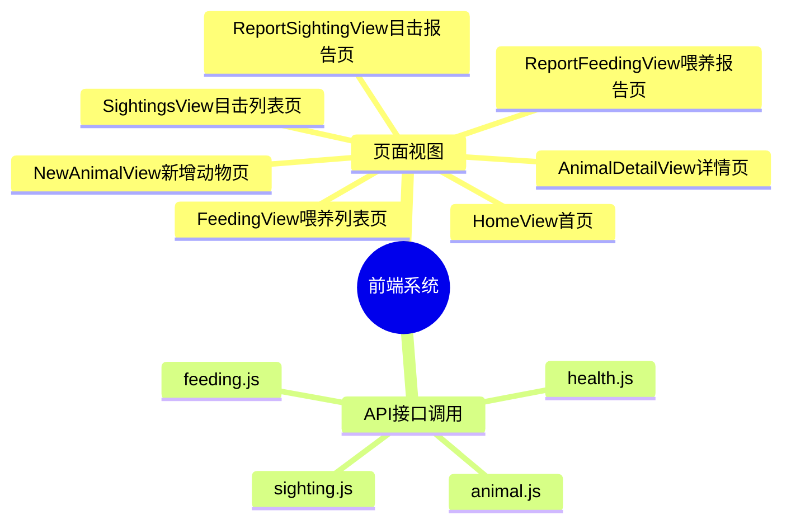

#### 核心功能模块

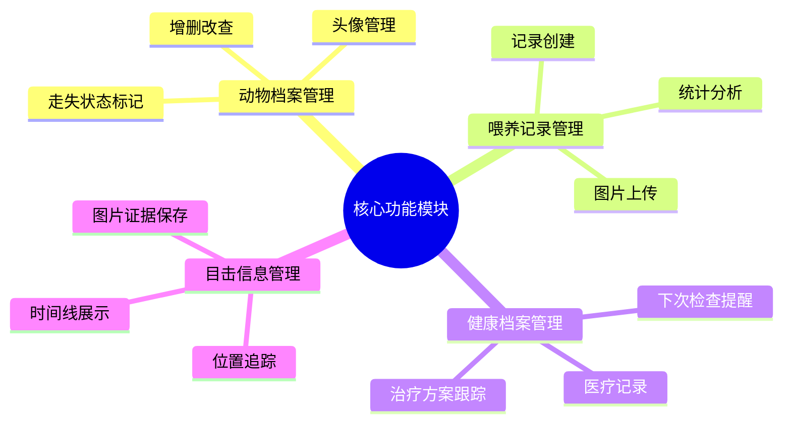

### 功能框图 - 分块展示

#### 用户交互流程

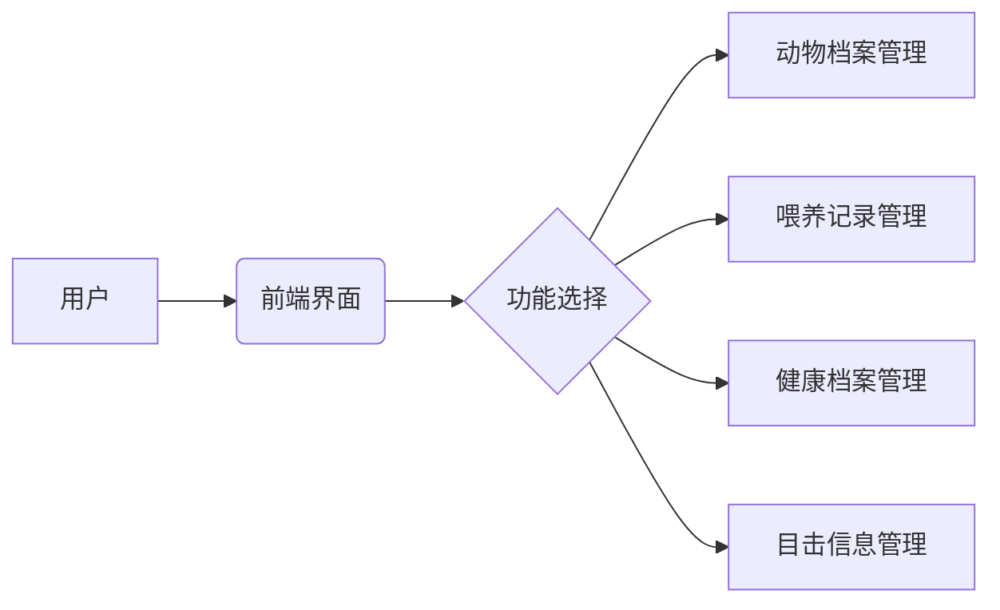

#### 动物档案管理子系统

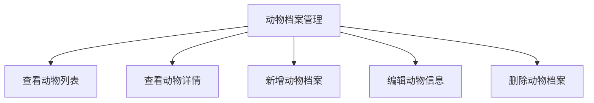

#### 喂养记录管理子系统

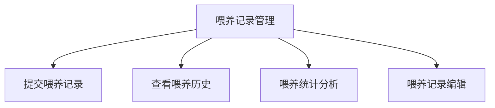

#### 健康档案管理子系统

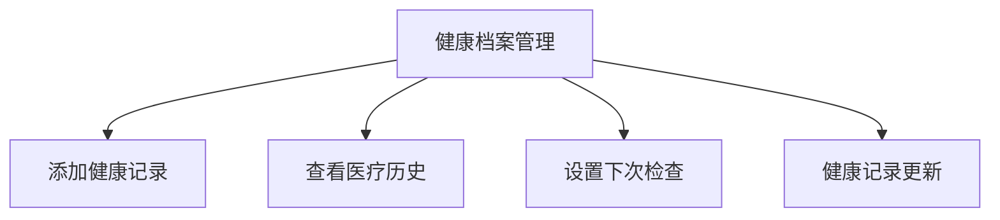

#### 目击信息管理子系统

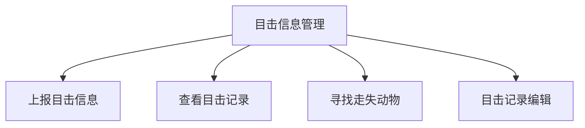

#### 后端服务架构

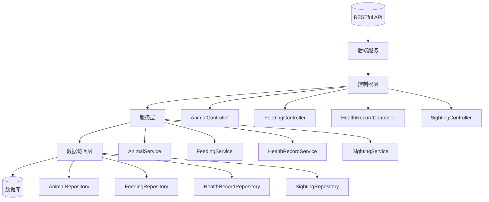

#### 数据库结构

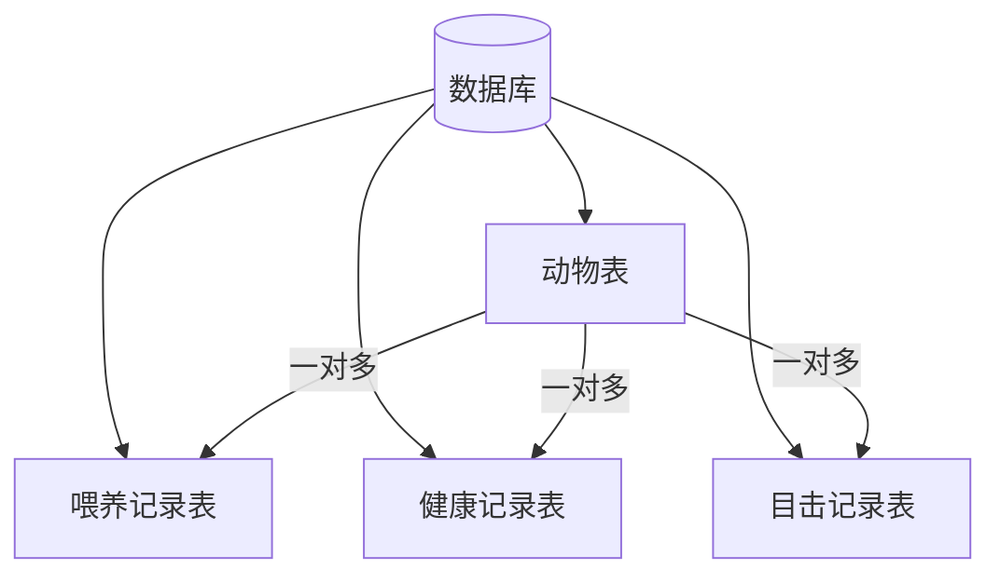

### 系统特点说明

#### 四大核心实体关系：

1. **Animal (动物)** - 系统的核心实体，存储动物的基本信息如名字、种类、性别、绝育状态、区域分布、外貌特征、性格特点、健康状况等。
2. **Feeding (喂养记录)** - 记录每次喂养活动的信息，包括喂养时间、地点、食物类型、品牌、分量、是否提供饮水等，并与特定动物关联。
3. **HealthRecord (健康记录)** - 存储动物的医疗健康信息，包括就诊日期、健康状态、治疗过程、兽医信息及下次复查安排等。
4. **Sighting (目击记录)** - 记录用户发现动物的时间、地点及相关描述，帮助追踪动物的位置变化，特别适用于寻找走失动物。

#### 主要业务流程：

1. **动物信息管理** - 用户可以创建、查看、更新和删除动物档案，维护动物的基础信息和状态。
2. **喂养记录追踪** - 志愿者或关心动物的人士可以提交喂养记录，系统支持图片上传和喂养统计。
3. **健康监护体系** - 兽医或相关工作人员可以录入动物的健康状况和治疗信息，建立完整的健康档案。
4. **位置动态追踪** - 通过用户上报的目击信息，追踪动物的活动范围和最新位置，特别是帮助寻找走失动物。

这套系统不仅有助于更好地照顾校园内的流浪动物，还能促进社区参与动物保护工作，提高动物福利水平，营造更加和谐的人与动物共存环境。

---

## 数据库设计

校园小动物守护者平台的数据库设计包含了四张核心表，分别用于存储动物信息、目击记录、喂养记录和健康记录。以下是详细的数据库表结构设计：

### 动物表 (animals)

这是系统的核心表，存储所有动物的基本信息。

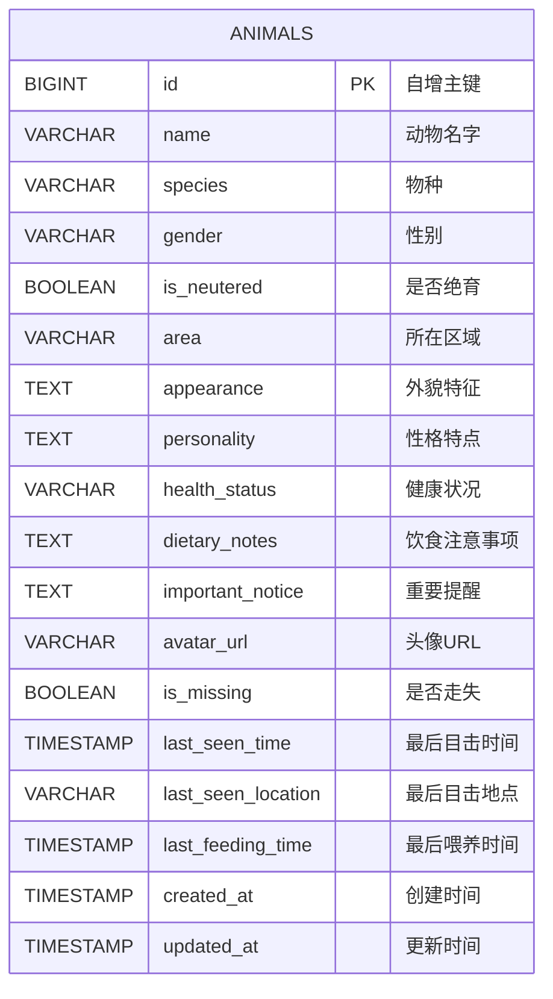

### 目击记录表 (sightings)

记录用户发现动物的时间、地点及相关描述。

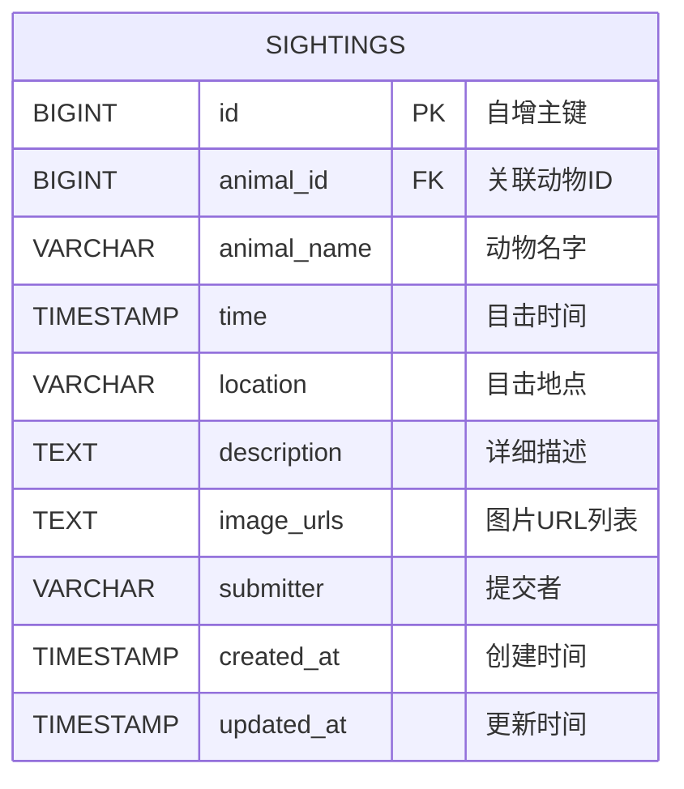

### 喂养记录表 (feedings)

记录每次喂养活动的信息。

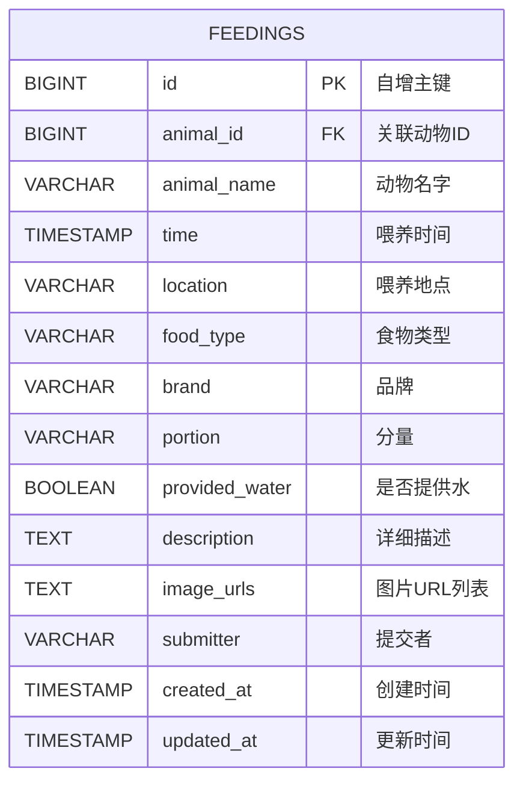

### 健康记录表 (health_records)

存储动物的医疗健康信息。

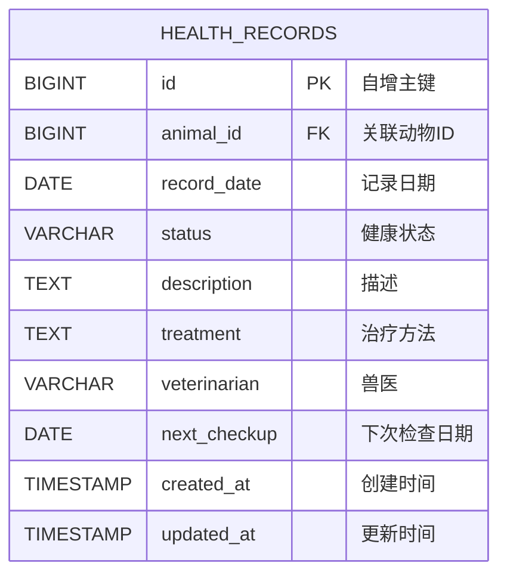

### 表间关系

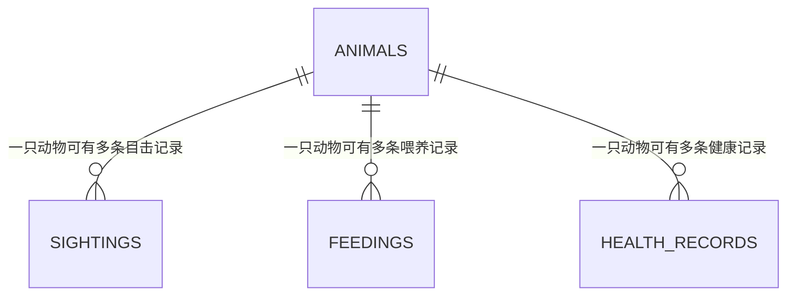

### 字段说明详解

#### animals 表字段说明：

| 字段名             | 类型         | 约束                                                  | 说明                   |
| ------------------ | ------------ | ----------------------------------------------------- | ---------------------- |
| id                 | BIGINT       | PRIMARY KEY, AUTO_INCREMENT                           | 动物唯一标识           |
| name               | VARCHAR(100) | NOT NULL                                              | 动物名字               |
| species            | VARCHAR(50)  | NOT NULL                                              | 物种（猫、狗、天鹅等） |
| gender             | VARCHAR(10)  | -                                                     | 性别                   |
| is_neutered        | BOOLEAN      | DEFAULT FALSE                                         | 是否绝育               |
| area               | VARCHAR(100) | -                                                     | 所在区域               |
| appearance         | TEXT         | -                                                     | 外貌特征描述           |
| personality        | TEXT         | -                                                     | 性格特点               |
| health_status      | VARCHAR(50)  | DEFAULT 'unknown'                                     | 健康状况               |
| dietary_notes      | TEXT         | -                                                     | 饮食注意事项           |
| important_notice   | TEXT         | -                                                     | 重要提醒事项           |
| avatar_url         | VARCHAR(255) | -                                                     | 头像图片URL            |
| is_missing         | BOOLEAN      | DEFAULT FALSE                                         | 是否走失               |
| last_seen_time     | TIMESTAMP    | -                                                     | 最后一次被看到的时间   |
| last_seen_location | VARCHAR(255) | -                                                     | 最后一次被看到的地点   |
| last_feeding_time  | TIMESTAMP    | -                                                     | 最后一次被喂食的时间   |
| created_at         | TIMESTAMP    | DEFAULT CURRENT_TIMESTAMP                             | 创建时间               |
| updated_at         | TIMESTAMP    | DEFAULT CURRENT_TIMESTAMP ON UPDATE CURRENT_TIMESTAMP | 更新时间               |

#### sightings 表字段说明：

| 字段名      | 类型         | 约束                                                  | 说明                 |
| ----------- | ------------ | ----------------------------------------------------- | -------------------- |
| id          | BIGINT       | PRIMARY KEY, AUTO_INCREMENT                           | 目击记录唯一标识     |
| animal_id   | BIGINT       | FOREIGN KEY REFERENCES animals(id)                    | 关联的动物ID         |
| animal_name | VARCHAR(100) | -                                                     | 动物名字（冗余字段） |
| time        | TIMESTAMP    | -                                                     | 目击时间             |
| location    | VARCHAR(255) | -                                                     | 目击地点             |
| description | TEXT         | -                                                     | 目击情况详细描述     |
| image_urls  | TEXT         | -                                                     | 相关图片URL列表      |
| submitter   | VARCHAR(100) | -                                                     | 提交者信息           |
| created_at  | TIMESTAMP    | DEFAULT CURRENT_TIMESTAMP                             | 创建时间             |
| updated_at  | TIMESTAMP    | DEFAULT CURRENT_TIMESTAMP ON UPDATE CURRENT_TIMESTAMP | 更新时间             |

#### feedings 表字段说明：

| 字段名         | 类型         | 约束                                                  | 说明                 |
| -------------- | ------------ | ----------------------------------------------------- | -------------------- |
| id             | BIGINT       | PRIMARY KEY, AUTO_INCREMENT                           | 喂养记录唯一标识     |
| animal_id      | BIGINT       | FOREIGN KEY REFERENCES animals(id)                    | 关联的动物ID         |
| animal_name    | VARCHAR(100) | -                                                     | 动物名字（冗余字段） |
| time           | TIMESTAMP    | -                                                     | 喂养时间             |
| location       | VARCHAR(255) | -                                                     | 喂养地点             |
| food_type      | VARCHAR(100) | -                                                     | 食物类型             |
| brand          | VARCHAR(100) | -                                                     | 食物品牌             |
| portion        | VARCHAR(100) | -                                                     | 分量描述             |
| provided_water | BOOLEAN      | DEFAULT FALSE                                         | 是否提供了饮用水     |
| description    | TEXT         | -                                                     | 喂养情况详细描述     |
| image_urls     | TEXT         | -                                                     | 相关图片URL列表      |
| submitter      | VARCHAR(100) | -                                                     | 提交者信息           |
| created_at     | TIMESTAMP    | DEFAULT CURRENT_TIMESTAMP                             | 创建时间             |
| updated_at     | TIMESTAMP    | DEFAULT CURRENT_TIMESTAMP ON UPDATE CURRENT_TIMESTAMP | 更新时间             |

#### health_records 表字段说明：

| 字段名       | 类型         | 约束                                                  | 说明             |
| ------------ | ------------ | ----------------------------------------------------- | ---------------- |
| id           | BIGINT       | PRIMARY KEY, AUTO_INCREMENT                           | 健康记录唯一标识 |
| animal_id    | BIGINT       | FOREIGN KEY REFERENCES animals(id), NOT NULL          | 关联的动物ID     |
| record_date  | DATE         | NOT NULL                                              | 记录日期         |
| status       | VARCHAR(50)  | NOT NULL                                              | 健康状态         |
| description  | TEXT         | -                                                     | 健康情况详细描述 |
| treatment    | TEXT         | -                                                     | 治疗方法描述     |
| veterinarian | VARCHAR(100) | -                                                     | 负责兽医         |
| next_checkup | DATE         | -                                                     | 下次检查日期     |
| created_at   | TIMESTAMP    | DEFAULT CURRENT_TIMESTAMP                             | 创建时间         |
| updated_at   | TIMESTAMP    | DEFAULT CURRENT_TIMESTAMP ON UPDATE CURRENT_TIMESTAMP | 更新时间         |

---

## 界面UI展示

### 首页

### 动物详情页面

### 报告目击页面

### 报告喂食页面

### 目击动态页面

### 喂食记录动态页面

### 新增动物档案页面

---

## 测试

前端详情看附件前端测试视频

后端测试与后端源代码test目录下有标准mvn完整api测试代码，测试结果全部通过。

---

## 负责分工

### 邓凯璇（37220222203575）

- **前端campus-pets-frontend全体开发**
- **后端campus-pets-backend全体开发以及数据库**
- **API文档制定及撰写**
- **原型设计参与**
- **试验报告撰写**

---

## 个人心得

### 邓凯璇（37220222203575）

此次项目本人负责项目主体搭建及实现。

第一个心得是，参与开发大型项目的首要工作就是规划清晰的项目开发框架及流程制定、项目分工制定，明确共享资源划分与个人模块分离去耦合。严格实现api对接与功能预期对接。本次前后端的开发过程中，多次出现api对接不齐导致前端无法正常运行的问题。以及初期分模块设计时容易出现模块功能未对齐的问题。后续借助agent项目框架分析和后端单独api测试，得以制定明确的API文档并实现前端对齐。

第二个心得是，工欲善其事，必先利其器。此次开发重点借助成熟的vue框架、spring-boot框架以及通义灵码agent，极大提高了开发效率，实现极短时间内的设计理念落地和后期工程debug与测试。在开发初期积极寻找有关工具，辅助开发绝对是有益的。但是agent的运用由于幻觉问题，还需要个人额外注意代码细节。其次，由于agent规划能力缺陷，实际使用时还需要个人提前规划好明确的问题分析及修改方案等，agent依据方案进行简单微调而不是全面掌控。最后，agent运用必须依据严格的top-down运行框架，逐步严格调整，避免幻觉问题带来的代码潜在bug。

第三个心得是，一个人走的快，一群人走的远。此次项目开发离不开我组另外两位成员的贡献，三个人彼此发挥特长，以长补短，得以保证项目开发不至于由于个人能力的短板而陷入停滞。

---

## 原型链接及仓库链接

### 原型链接

由于墨刀限制，见附件具体html文件。

### 仓库链接

https://gitee.com/dkx2024/xmu_-animal

